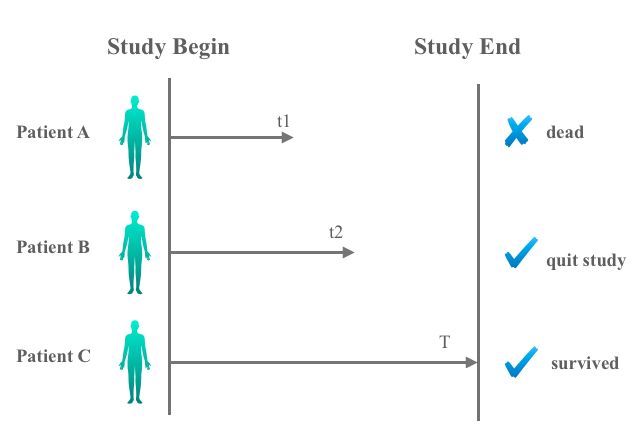

\newpage


```{r setup, include=FALSE}
knitr::opts_chunk$set(echo = TRUE)
knitr::opts_chunk$set(message = F)
knitr::opts_chunk$set(warning = F)

library(tableone)
library(tidyverse)
library(survival)
library(survminer)
library(GGally)
library(survRM2)
library(knitr)
library(kableExtra)
library(ggRandomForests)
library(pROC)
library(ggfortify)
library(broom)
library(finalfit)
library(MatchIt)
```


# Motivation

[Right heart catheterization(RHC)](https://www.hopkinsmedicine.org/healthlibrary/test_procedures/cardiovascular/right_heart_catheterization_135,40), also known as pulmonary artery catheterization, is an invasive test that mainly checks the working state of the heart by guiding a pulmonary artery (PA) catheter (a small and hollow tube) through the pulmonary artery and into the right chambers of the heart. Here is the video which enables you to understand how it works.

<div align="center">
<iframe width="550" height="300" src="https://www.youtube.com/embed/xr-VkxUwceQ" frameborder="0" allow="accelerometer; autoplay; encrypted-media; gyroscope; picture-in-picture" allowfullscreen>
</iframe>
</div>

<center>
[source: https://www.youtube.com/embed/xr-VkxUwceQ ]
</center>

It is often the case that a foreign objects enters the humen body, there is the risk of infection. RHC is no different. When the tube is put into the artery and a dye is injected into the heart, potential complications are the rupture of pulmonary artery, arrythmias of the heart where the heart may skip a beat. However, the widespread belief is it beneficial and safe makes it difficult to design a randomized controlled trail(RCT). 

Without RCTs of RHC, the only way to evaluate its effectness is observational study. The motivation of this case study is to reveal the association between time to death in 30 days and RHC based on an observational dataset. The main predictor of the model is RHC, we also adjust the model with all the other variables in the dataset. We want to know whether RHC actually improves the patients' survival rate in 30 days adjusted by other baseline variables.


The libraries used in this study are listed in the following table, 
along with their purpose in this particular case study:

|Library|Purpose|
|---|--------------------------------------------------------------------------------------------------------------|


In order to run this code please ensure you have these packages installed. 

The learning objectives for this case study include:

  * causal inference
  * propensity score matching
  * multivariate logistic regression
  * survival analysis
  

# What is the data?

[Right heart catheterization](http://biostat.mc.vanderbilt.edu/wiki/pub/Main/DataSets/rhc.csv): The dataset pertains to day 1 of hospitalization, i.e., the treatment variable `swang1` is whether or not a patient received an RHC (also called the Swan-Ganz catheter) on the first day in which the patient qualified for the study. The variable description can be found [here](http://biostat.mc.vanderbilt.edu/wiki/pub/Main/DataSets/rhc.html).


# Data Import

The data is an online resources, we will import data from the web directly  with `read_csv()` function. This dataset was originally used in Connors et al. JAMA 1996;276:889-897, and has been made publicly available.

```{r}
file <- "http://biostat.mc.vanderbilt.edu/wiki/pub/Main/DataSets/rhc.csv"
rhc <- read_csv(file)
```


# Data Wrangling

## Variable selection

There are totally `r ncol(rhc)` variables and `r nrow(rhc)` observations in the dataset. By reading the description of the data, we just want to select several variables here. When you try to reproduce this case study, you can try to choose others which you are interested in.  

```{r}
rhc_df <- 
  rhc %>% 
    select(age = age,
           sex = sex,
           race = race,
           education = edu,
           income = income,
           med_ins = ninsclas,
           disease = cat1,
           cancer = ca,
           weight = wtkilo1,
           temp = temp1,
           bp = meanbp1,
           resp = resp1,
           hrt = hrt1,
           pf = pafi1,
           pc = paco21,
           ph = ph1,
           death = dth30,
           time = t3d30,
           RHC = swang1)
#summary(rhc_df)
```

According to the [codebook](http://biostat.mc.vanderbilt.edu/wiki/pub/Main/DataSets/rhc.html),the description of variables we interested in is given below.

| variable names   |      meaning      |
|---------------------------------|---------------------------------|
| age                                  | Age                                                                                                                                                                 |
| sex                                  | Sex                                                                                                                                                                 |
| race                                 | Race                                                                                                                                                                |
| education                            | Years of education                                                                                                                                                  |
| income                               | Income                                                                                                                                                              |
| med_ins                              | Medical insurance                                                                                                                                                   |
| disease                              | Primary disease category                                                                                                                                            |
| cancer                               | Cancer                                                                                                                                                              |
| weight                               | Weight                                                                                                                                                              |
| temp                                 | Temperature                                                                                                                                                         |
| bp                                   | Mean blood pressure                                                                                                                                                 |
| resp                                 | Respiratory rate                                                                                                                                                    |
| rth                                  | Heart rate                                                                                                                                                          |
| pf                                   | PaO2/FIO2 ratio,ratio of arterial oxygen partial pressure to fractional inspired oxygen                                                                             |
| pc                                   | PaCo2 ratio,partial pressure of arterial carbon dioxide                                                                                                             |
| ph                                   | PH                                                                                                                                                                  |
| time                                 | Survival time of each patient in 30 days                                                                                                                            |
| death                                | Indicates whether the patient survived or dead in 30 days                                                                                                           |
| RHC                                  | Right heart catheterization |


# Exploratory data analysis

Our main topic is to investigate the influence of RHC, so let's devide the dataset into 'RHC' group and 'No RHC' group and try to find some difference between them. The demographics can help us understand the one to one relation between right heart catheterization and other symptoms.

We will use function `CreateTableOne()` in package [`tableone`](https://www.rdocumentation.org/packages/tableone/versions/0.10.0) to summarize both continuous and categorical variables. It is optionally stratified by one or more startifying variables and performs statistical tests. The object gives a table that is easy to use in medical research papers.

```{r echo=T, results='hide'}
CreateTableOne(data = rhc_df, strata = 'RHC') %>%
  print() -> tblprint

tblprint[c(3, 4, 9, 14, 21, 31, 43, 45),4] <- 'Chi-sq'
#tblprint[c(2, 8, 49, 50, 51, 52, 53, 54),4] <- 't-test'
```

```{r}
kable(tblprint , "html", 
      caption = "Stritified by Right Heart Catheterization", booktabs = T) %>%
  kable_styling('responsive') %>%
  add_indent(c(5:7, 10:13,15:20,22:30,32:34))
```

What do you see? Take a moment to reflect on what these differences suggest for the relationship of interest. The unadjusted outcomes indicate that patients managed with RHC were more likely to be white male, to have private insurance, to have under $11k income, to enter the study of [ARF](https://en.wikipedia.org/wiki/Acute_kidney_injury), [MOSF](https://en.wikipedia.org/wiki/Multiple_organ_dysfunction_syndrome) or [CHF](https://en.wikipedia.org/wiki/Heart_failure), which are acute kidney injury, multisystem organ failure and chronic heart failure respectively. Patients with RHC were less likely to have cancer. 

## Data visualization

Data visuzlization is adjective considering it enables us to get a grasp on the difference between 'No RHC' and 'RHC' group. We would like to use `ggplot2` to create some plots.

```{r, fig.width=11, fig.height=5}
p1 <- rhc_df %>% 
        ggplot(aes(x = RHC, fill = sex)) + 
          geom_bar() +
           ggtitle('distribution of RHC')
p2 <- rhc_df %>% 
        ggplot(aes(x = RHC, fill = race)) + 
          geom_bar(position = "fill") + 
           ggtitle('distribution of RHC') + 
          ylab('proportion')

p3 <- rhc_df %>% 
        ggplot(aes(x = RHC, fill = med_ins)) + 
          geom_bar(position = "fill") + 
           ggtitle('distribution of RHC') + 
          ylab('proportion')

ggarrange(p1, p2, p3, ncol=3, nrow=1)
```

These plots further prove our undersatnding of the characteristics of patients: patients managed with RHC were more likely to be white male, to have private insurance. Here we just provide three examples, but try more variables you are interested in!

Besides three categorical variables, we also choose three continuous variables and visualize them.

```{r, fig.width=11, fig.height=5}
p4 <- rhc_df %>% 
        ggplot(aes(x = RHC, y = age, fill = RHC)) + 
          geom_boxplot() + 
           ggtitle('distribution of age')
p5 <- rhc_df %>% 
        ggplot(aes(x = RHC, y = bp, fill = RHC)) + 
          geom_boxplot() + 
           ggtitle('distribution of blood pressure') +
            ylab('blood pressure')
p6 <- rhc_df %>% 
        ggplot(aes(x = RHC, y = pf, fill = RHC)) + 
          geom_boxplot() + 
            ggtitle('distribution of PaO2/FiO2') +
              ylab('PaO2/FIO2 ratio')

         
ggarrange(p4, p5,p6, ncol=3, nrow=1)
```

Age difference between two groups seems to be negligible while blood pressure and PaO2/FIO2 ratio vary largely. We see that patients who receive RHC tend to have lower blood pressure than patients who are not. Similiarly, patients who receive RHC tend to have lower PaO2/FIO2 ratio, which indicates that blood pressure and PaO2/FIO2 ratio are related to receiving RHC or not.


# Data analysis

## Survival analysis

[survival analysis](https://en.wikipedia.org/wiki/Survival_analysis) is a branch of statistics for analyzing the expected duration of time until one or more events happen, such as death in biological organisms and failure in mechanical systems. 


### Outcome and time variables

Changing the type of the data is also very important for survival analysis, and by checking the data, we need to deal with variables denoted as characters. In our data set, the status of having RHC or not is not numeric. A way to adjust is to force it into factor directly. However, this kind of factor format sometimes does not work in some of the packages in R. Therefore, we pushed the character into a numeric number.

```{r}
#recode_factor(rhc_df$RHC, 'No RHC'="0", RHC = '1')
```

```{r}
rhc_df$death <- as.numeric(as.factor(rhc_df$death)) -1
rhc_df$RHC <- as.numeric(as.factor(rhc_df$RHC)) - 1
```

`as.factor()` is used to encode vector as a factor automatically. Then we use `as.numeric()` to transform the factor as numerical variable. In our case, after these step, "RHC" will be encoded as 2 while "No RHC" will be encoded as 1. Then we deducted it by 1 to get the numeric denotation that we want, which are 1 and 0 respectively.

### Right censoring

One condition makes the survival analysis difficult is [censoring](https://en.wikipedia.org/wiki/Censoring_(statistics)). Censoring is a condition in which the value of a measurement or observation is only partially known. There are various kinds of censoring but you might want to restrict yourselves to right-censoring, which is the most common case in survival analysis.

<center>

</center>

Suppose there are three patients, A, B and C enroll in the study and the period of this study is $T$. Patients A died at time $t_1$ so he requires no censoring since we know his exact survival time; Patients B quitted the study at time $t_2$ ($t_2<T$). In this case, he needs to be censored since we just know he survived until $t_2$ but we have no idea of his exact survival time; Patients C is very lucky! He survived until the end of the study so his survivial equals to $T$. However, he also needs to be censored! Why? This is because we still don't know his exact survival time either. Therefore, right censoring can play an important role here : the true survival times will always be equal to or greater than the observed survival time.


### Kaplan Meier (non-parametric)

The [Kaplan Meier estimator](https://en.wikipedia.org/wiki/Kaplan–Meier_estimator) is a non-parametric method used to estimate the survival probability. It is often used to estimate the survival rate stratified by some treatment of interest.

`Surv()` function creates a survival object, usually used as a response variable in a simple case of right-censored data. 

```{r}
sur_obj <- Surv(rhc_df$time, rhc_df$death) 
sur_obj[1:10]
```

`sur_obj` is basically a compiled version of the `time` and `death` that can be interpreted by the `survfit()` function. Do you see `+` behind survival times? This is what we discussed before - right censored data points. 30+ indicates this patient survived until the end of the study while 2 means this patient died at the second day after study began.

Then we apply `survift()` to compute an estimate of a survival curve for censored data. Both of these two functions comes from package [`survival`](https://www.rdocumentation.org/packages/survival/versions/2.11-4).

```{r}
fit <- survfit(sur_obj ~ RHC, data = rhc_df)
fit
```

The total number of the patients having right catheterization is `r sum(rhc_df$RHC == 1, na.rm = TRUE)`, and `r sum(rhc_df$RHC == 1, na.rm = TRUE)-fit$n.censor[58]` of them died in 30 days(38%). The total number of the patients not having right catheterization is `r sum(rhc_df$RHC == 0, na.rm = TRUE)`, and `r sum(rhc_df$RHC == 0, na.rm = TRUE) - fit$n.censor[29]` of them died in 30 days(30.6%).


To show the survival curve, `autoplot()` function can generate a ggplot for `scuvfit` object. It is called Kaplan Meier plot, which shows us the survival rate stratified by having the RHC without any covariates adjustment.

```{r}
autoplot(fit, conf.int = FALSE) +
  labs(title = 'Kaplan Meier Plot', 
       y = 'survival probability',
       color = 'RHC', fill = 'RHC') +
  theme_bw() +
  scale_color_manual(labels = c("No RHC", "RHC"), 
                     values = c("red", "blue"))
```

The x-axis is the survival time, and the y-axis is the survival probability. It looks like a step function since the probability changes each day(the data only record the event daily).

Some of the description of the plot: at the beginning, all the patients survived. The survival probability of patients having the right catheterization is about `r fit$n.censor[58]/sum(rhc_df$RHC == 1, na.rm = TRUE)` and `r fit$n.censor[29]/sum(rhc_df$RHC == 0, na.rm = TRUE)` for patients not having the right catheterization. 

We see difference in Kaplan Meier plot and it seems that patients with RHC treatment have much lower survival rate. But do you remeber? We also see difference for covariates distribution in 'Data visualization' section. Therefore, we are curious about what if we adjust the model by the variables that we are interested in? Whether this difference of survival probability will keep after covariates adjustment? This push us to the next part - Propensity score matching.


## Propensity score matching

As we mentioned above, RHC is beneficial is the popular belief, which makes it harder to build a RCT. [Revelant paper](https://www.ncbi.nlm.nih.gov/pubmed/8782638) explained this phenomenon like this: "In ovservational studies, the treatment selection has connection with patients characteristics but also has link with the outcomes. For example, patients with lower blood pressure are more likely to get RHC, and they are also more likely to die. The effect of such treatment selection bias has been called "confounding by indication". To adjust for treatment selection bias, the variables that independently affect the decision to use or withhold the treatment must be identified and measured, that's why we introduce [propensity score matching (PSM)](https://en.wikipedia.org/wiki/Propensity_score_matching) here. "

In the statistical analysis of observational data, PSM is a statistical matching technique that attempts to estimate the effect of a treatment, policy, or other intervention by accounting for the covariates that predict receiving the treatment. PSM attempts to reduce the bias due to confounding variables that could be found in an estimate of the treatment effect obtained from simply comparing outcomes among units that received the treatment versus those that did not. 

The general procedures of PSM we would like to use include:


* Run logistic regression:
    + Dependent variable: Y = 1, if with RHC; Y = 0, otherwise.
    + Choose appropriate condounders and apply multivariate logistic regression.
    + Obtain propensity score, which is the predicted probability(p). Higher score indicates a higher probability of receiving the treatment.

* One-to-one matching on propensity score:
    + Randomly select one patient with RHC.
    + Match this patient who has the cloest propensity score in all patients with RHC. The difference should less than a certain threshold.(discuss later)
    + Continue this matching untill all possible pairs were identified.
    
  
<center>

</center>

To enhance your understanding, we use a plot to explain it again. Each dot represent a sample in the observatinal study. Original dataset includes 3 patients with RHC treatment and 7 patients without RHC treatment. Once we collected the features, logistic regression will be fit and propensity score will be calculated, as indicated by the size of these dots. Next they will be matched based on propensity score. The closer their propensity score are, the more likely they will be matched as a pair. 

Suppose the threshold is 0.2. There is an obvious pair on the left corner: A and B, since they have equal score: 0.2; While on the right side, the condition is a little complicated. Around patient C, there are two patients in No RHC group. Both of them close to C and both of their difference are under threshold. However, based on nearst neighbour method, patient C and D will be matched together because their difference is smaller; For patient F in RHC group, there is no patient whose score difference is lower than 0.2 around he. In this case, patient F fails to be matched and will be removed. Finally, two pairs are matched successfully so the matched dataset are consist of 2 patients with RHC treatment and 2 patients without RHC treatment.


### Run logistic regression
 
`glm()` function is a widespread use to perform generalized linear model. The argument `family =` provides a convenient way to specify the details of the models used. Here we set `binomial(link = "logit")` so it will apply logistic regression.

```{r}
psm_glm <- glm(RHC ~ .-time-death, 
               family = binomial(link = "logit"), 
               data = rhc_df)
```

Using this model, it is easy to calculate the propensity score for each patient. It is simply the patient’s predicted probability of receiving RHC, given the estimates from the logit model. Then, we calculated this propensity score with the help of `predict()` and create a dataframe that has the propensity score as well as the patient’s actual treatment status.

```{r}
glm_df <- data.frame( p_rhc <-  predict(psm_glm, type = "response"),
                     # Predicted probability of being assigned to RHC
                      p_norhc <-  1 - p_rhc,
                     # Predicted probability of being assigned to no RHC
                      RHC <-  psm_glm$model$RHC)
```

After estimating the propensity score, histograms of the estimated propensity scores by treatment status is shown below.

```{r}
glm_df %>%
  mutate(RHC = ifelse(RHC == 1, "RHC", "No RHC")) %>%
  ggplot(aes(x = p_rhc)) +
  geom_histogram(color = "white") +
  facet_wrap(~RHC) +
  xlab("Probability of receiving RHC before matching") +
  theme_bw()
```

It is obvious the distribution of propensity score is not balanced, that's why we will move to the next step: one-to-one matching.


### One-to-one matching on propensity score

`matchit()` is the main command of the package [`MatchIt`](https://cran.r-project.org/web/packages/MatchIt/MatchIt.pdf), which enables parametric models for causal inference to work better by selecting well-matched subsets of the original treated and control groups.

The arguments provided by `matchit()` are given below:

* `formula`: Specifies the logistic regression formula you would like to use. Just equals to `psm_glm` we performed in last section.

* `data`: Data frame (or database table name) containing the variables for analysis in the formula arguments.

* `method`: Specifies the matching method. Default is "nearst(nearst neightbour matching)".

* `caliper`: Nearest neighbor matching has a further restriction that the absolute difference in the propensity scores of matched subjects must be below some prespecified threshold (the caliper distance). [Cochran and Rubin (1973)](https://www.ncbi.nlm.nih.gov/pmc/articles/PMC3144483/#s5title) suggested using a caliper size of one-fifth of a standard deviation of the sample estimated propensity scores.

* `ratio`: Indicates one-to-one matching — every treatment case will be matched with one control case. You can increase the number of control cases matched to each treatment case by increasing this number; usually this number is between 1 and 5.


To specify the value of `caliper`, the standard deviation of the logit odds of estimated propensity scores is necessary. That is what we calculated in previous section. `p_rhc` will come into useful now!

```{r}
epsilon <- 0.2*sd(log(p_rhc/(1-p_rhc)))

psm_mod <- matchit( RHC ~ age + sex + race + education +
           income + med_ins + disease + cancer +
           weight + temp + bp + resp + hrt + pf +
           pc + ph, data = rhc_df, method = "nearest", 
           caliper  = epsilon, ratio = 1)

rhc_psm_df <- match.data(psm_mod)
#head(rhc_psm_df)
```

Using `match.data()`, we can get the final dataset, `rhc_psm_df`. Note that the final dataset is smaller than the original: it contains `r dim(rhc_psm_df)[1]` observations, meaning that `r 0.5*dim(rhc_psm_df)[1]` pairs of treated and control observations were matched. It also contains a variable called distance, which is the propensity score.  

```{r}
rhc_psm_df %>%
  mutate(RHC = ifelse(RHC == 1, "RHC", "No RHC")) %>%
  ggplot(aes(x = distance)) +
  geom_histogram(color = "white") +
  facet_wrap(~RHC) +
  xlab("Probability of receiving RHC after matching") +
  theme_bw()
```


Now the distibution of propensity score are much more balanced! So the matching is done well. In addition to ploting by yourself, there is an another way to inplement the result.

```{r}
plot(psm_mod,type = "hist" )
```

Just putting the model name in `plot()` can offer you a nice plot, showing the overall comparison. It shows the histograms of distribution of propensity score before and after matching. The histograms before matching on the left differ to a great degree. The histograms after matching on the right are very similar however.


## Cox Proportional Hazard Model

In logistic regression, we know that whether an event is going to happen or not, and you could see survival analysis as an updated version of logistic regression where you could see when that event would happen.

Cox proportional hazards model is a class of parametric survival models in statistics. Different with Kaplan Meier model, except for variables like the time that passes, the event occurs, it also includes other covariates that used to adjust the association of survival rate and time.

A fundamental assumption of the cox proportional hazards model is that the model assumes the hazard is constant with the time passing by.

### Theoretical Concepts

#### 1. Survival Function

Let $T$ represent survival time and we regard it as a random variable. Its cumulative distribution function is

$$P(t) = Pr(T \leq t)$$

The complement of the distribution function is survival function $S(t)$

$$S(t) = Pr(T>t) = 1 - P(t)$$

To simplify, the survival rate equal to the probability of surviving at time t or one minus the probability of dying at time t.


#### 2. Hazard Function

It describes the probability of an event or its hazard $h(t)$ if the patient survived up to that particular time point $t$.

$$h(t) =\displaystyle{\lim_{x \to \Delta t}} \frac{ P(t \leq T <t+\Delta t|T \ge t)}{\Delta t}$$

$$h(t) = \frac{f(t)}{S(t)}$$


wehre $f(t) = P(t=T)$

Proporites of Hazard Function are given below:

+ non-increasing

+ survival rate at time 0 equal to 1

+ survival probability at time infinity equal to 0

+ the hazard function assumes proportional hazard meaning that the hazard is constant


#### 3. Linear-like Model

Our goal is to investigate the survival distribution with consideration of all other covariates. This examination entails the specification of a linear-like model for the log hazard:
$$log~h(t)= \alpha+\beta~X $$
or equivalently,

$$h(t)= exp(\alpha+\beta~X )$$
where $\beta$ is the coefficients matrix and the $X$ is the covariates matrix.

If we set a baseline function $h_0(t) = \alpha$, we can estimate the hazard fuction like this:

$$h(t) = h_0(t) e^{\beta X}$$

### Model Application

The Cox proportional hazards model is fitted by `coxph()` function, located in `survival` package. Simariliy, we also need to create a survival object first and then fit the model.

Just notice the structure of `rhc_psm_df`. Besides the origin variables, `rhc_psm_df` also includes propensity socre and weight calcuated by `matchit()`, which we do not need in model fitting. So we remove unecessary variables and fit the model with all the other variables.

```{r}
fit1 <- coxph(Surv(time, death) ~ . - time - death -
              distance - weights, 
              data = rhc_psm_df)
res <- tidy(fit1)
head(res)
```
The `tidy()` function in the `broom` package provides a dataframe representation of the model's output. We just show the head of it here but you are encouraged to research more if you are interested in!

The coefficients are interpretable as multiplicative effects on the hazard. If the exponentiated coefficient is larger than 1, the variable will increase the survival probability and vice versa.

Thus, for example, holding the other covariates constant, an additional year of age increases the monthly hazard of death by `r (exp(res[1,2])-1)` on average. Similarly, compared with female, male have `r (exp(res[2,2])-1)` increased monthly hazard of death.


### Adjusted Survival Plot

Having fit a Cox proportional hazards model to the data, it is often of interest to examine the estimated distribution of survival times. The `survfit()` function estimates $S(t)$, by default at the mean values of the covariates.

We could estimate the new survival plot by inputting the main predictor `RHC`. We first code all `RHC` as 0 to predict the survival rate for 'No RHC' group, and input all `RHC` as 1 to predict the survival rate for 'RHC' group.

```{r}
rhc0 <- rhc1 <- rhc_psm_df
rhc0$RHC <- 0
rhc1$RHC <- 1
```

```{r}
time0 <- survfit(fit1, newdata = rhc0)$surv
time1 <- survfit(fit1, newdata = rhc1)$surv

dim(time0)

dat.time <- data.frame(t0 = rowMeans(time0),
                       t1 = rowMeans(time1))
```

`time0` is the survival time of 'No RHC' group while `time1` is the survival time of 'RHC' group for `r dim(time0)[2]` observations in `r dim(time0)[1]` days. To plot the mothly survival trend as a whole, we take mean of `r dim(time0)[2]` observations for two groups, and plot it with function `geom_step()`.


```{r}

ggplot(dat.time) +
  geom_step(aes(x =1:length(dat.time$t0),
                y = t0, col = 'blue')) +
  geom_step(aes(x =1:length(dat.time$t1),
                y = t1, col = 'red')) +
  theme_minimal() + labs(colour="Strata", x = "survival time", 
                         y = "probability", colour = 'RHC',  
                         title = 'Survival Plot after adjustment') +
  scale_color_manual(labels = c("No RHC", "RHC"), 
                     values = c("blue", "red"))

```
Function `theme_minimal()` gives us a minimalistic theme with no background annotations. 

The final plot indicates that after adjusting the covariates, patients in RHC group still have lower survival rate than No RHC group. However, the difference between these two groups is not that large compared with unadjusted result. The result after adjusting all covariates shows that RHC is less harmful than without modification.


# Summary

In this case study, we mainly revealed the association between time to death in 30 days and RHC based on an observational dataset. We covered various fields to deal with this situation, such as survival analysis, propensity score matching and Cox proportional hazards model. In conclusion, RHC has a positive relationship with risk of mortality even though we applied adjustment. 

At first we separated the dataset in two groups, No RHC group and RHC group, based on the variable `RHC`. We gave a table to show the distribution of all variables in two groups and found some of them have large difference while others do not vary too much. Then we tried Kaplan Meier method, a non-parametric method, to find the relationship of survival rate and whether a patient receive RHC treatment or not. The result was shown as a survival curve plot. It provided us an initial understanding that survival rate is significantly better in population managed without RHC treatment. 

But, since it is an observational dataset, the bias in treatment selection is an unavoidable problem, resulting in lower accuracy. To solve it, we made use of a causal inference method: propensity score matching. Logistic regression was applied to determine the probability of receiving RHC (propensity score). It represented the relationship between multiple covariates and the use of RHC and was used as a criteria to match. We matched observation based on propensity score and finally kept `r 0.5*dim(rhc_psm_df)[1]` pairs. As expected, the outcomes was pretty successful considering a much more balanced distribution of propensity score in two groups.

In the next step, we further improved our survival analysis model by using a parametric method: Cox proportional hazards model. All necessary variables were included, avoiding that we may ingore potential risks. Adjusted outcomes matched unadjusted outcomes: Patients with RHC treatment are less likely to survive in 30 days. Nevertheless, RHC treatment was not that harmful with adjustment, proving the necessity of what we did.

There also exists much more space for further improvement such as variable selection and model engineering. There was never enough work on how to include more influential variables. Additionally, our outcomes seem to be opposite to the widespread belief that RHC is recommended in broad clinical application, this may be caused by the confounding variables which increase the probability of receiving RHC and the probability of death overall. We admit the limitation of this study and would like to receive more suggestion to better understand the role of RHC. 


# Reference

Lin DY, Psaty BM, Kronmal RA (1998): Assessing the sensitivity of regression results to unmeasured confounders in observational studies. Biometrics 54:948-963 for useful methods for sensitivity analysis, one of which was applied to the RHC results.

