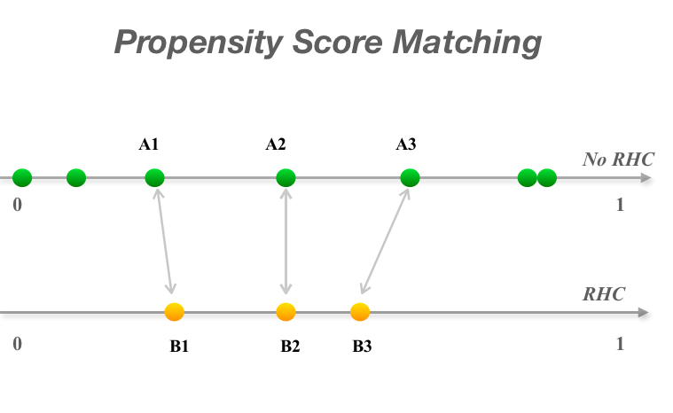
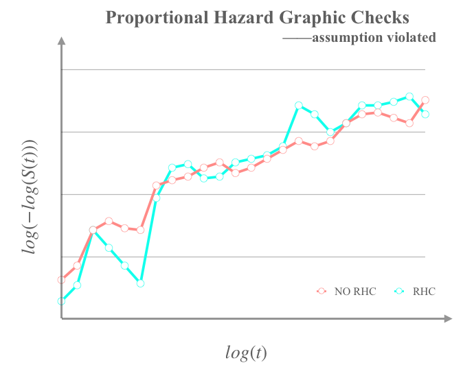

```{r setup, include=FALSE}
knitr::opts_chunk$set(echo = TRUE)
knitr::opts_chunk$set(message = F)
knitr::opts_chunk$set(warning = F)
```


# Motivation

[Right heart catheterization (RHC)](https://www.hopkinsmedicine.org/healthlibrary/test_procedures/cardiovascular/right_heart_catheterization_135,40), also known as pulmonary artery 
catheterization, can be used to see how well or poorly a 
patient's heart is pumping or to measure the 
pressure in a patient's heart and lungs. Broadly, 
the procedure guides a pulmonary artery (PA) catheter 
(a small and hollow tube) through the pulmonary artery 
and into the right chambers of the heart. Here is the
video to help describe in more detail how it works.

<div align="center">
<iframe width="550" height="300" src="https://www.youtube.com/embed/xr-VkxUwceQ" frameborder="0" allow="accelerometer; autoplay; encrypted-media; gyroscope; picture-in-picture" allowfullscreen>
</iframe>
</div>

<center>
[source: https://www.youtube.com/embed/xr-VkxUwceQ]
</center>

However, it is often the case that when a foreign object 
enters the human body, there is the risk of infection. RHC
is no different. When the tube is put into the artery and 
a dye is injected into the heart, potential complications 
include the rupture of pulmonary artery or arrythmias of 
the heart where the heart may skip a beat. 

To evaluate the benefit of RHCs, one approach is to use a 
randomized controlled trial (RCT). However, because of the 
widespread belief that RHCs are beneficial and safe, it 
makes it difficult to use RCTs. Without RCTs of RHCs,
another approach to evaluate its effectiveness is an
observational study. 

The motivation of this case study is to investigate 
whether or not there is an impact on a patient's overall 
survival (or mortality) due to the use of a patient being 
treated with a RHC in an observational dataset. 

Our main predictor of interest is RHC, but we also want 
to adjust for all other potential confounders in the dataset 
as this is an observational study. Here, we want to know 
whether RHC actually improves the patient's overall survival 
within 30 days of being given a RHC, but adjusted by other
baseline variables, including age, race, blood pressure, etc.

In addition to loading the set of R packages from the
[`tidyverse`](https://www.tidyverse.org) that we will use 
for data manipulation, exploration and visualization, we also 
use the following R packages and describe their purpose 
for this this particular case study:

|R package|Purpose|
|---|--------------------------------------------------------------------------------------------------------------|
|`tableone`|Creates a table ('Table 1' below) to describe baseline characteristics of the population|
|`kableExtra`|Helps with building complex tables and manipulating table styles; creates awesome HTML tables|
|`broom`|Takes the messy output of built-in functions in R such as `lm` or `t.test`, and turns it into tidy data frames|
|`ggpubr`|Provides some easy-to-use functions for creating and customizing `ggplot2`- based publication ready plots|
|`ggfortify`|Data visualization tools for statistical analysis result|
|`gridExtra`|Provides a number of user-level functions to work with "grid" graphics|
|`ggplot2`|Create elegant data visualisations using the grammar of graphics|
|`survival`|Contains the core survival analysis routines, including definition of Surv objects, Kaplan-Meier and Cox models etc.|
|`survminer`|Drawing Survival Curves using 'ggplot2'|
|`knitr`|Provides a general-purpose tool for dynamic report generation in R|
|`MatchIt`|Nonparametric preprocessing for parametric causal inference|

In order to run this code please ensure you have these packages installed. 

```{r,warning = F}
library(tableone)
library(kableExtra)
library(tidyverse)
library(broom)
library(ggpubr)
library(ggfortify)
library(gridExtra)
library(ggplot2)
library(survival)
library(survminer)
library(knitr)
library(MatchIt)
```


The learning objectives for this case study include:

  * some basic data wrangling and visualizations (using the `tidyverse` packages)
  * a causal inference method: propensity score matching (using the `MatchIt` package)
  * multivariate logistic regression (using `stats` package)
  * survival analysis (using `survival` package)

# What is the data?

The data are available to download as a `.csv` at this
[link](http://biostat.mc.vanderbilt.edu/wiki/pub/Main/DataSets/rhc.csv). 
The dataset includes a set of patients who were hospitialized
and either did or did not received an RHC (also called the 
Swan-Ganz catheter) on day 1 of hospitalization. This
treatment variable in the dataset is called `swang1`. 
The description of all variables can be found in
[codebook](http://biostat.mc.vanderbilt.edu/wiki/pub/Main/DataSets/rhc.html).


# Data Import

As the data are avaiable online, we will import data 
from the web directly with `read_csv()` function from the 
[`readr` package](https://cran.r-project.org/web/packages/readr/readr.pdf) 
as part of the `tidyverse`. This dataset was 
originally used in Connors et al. 1996 [@rhc_ref1],
and has been made publicly available.

```{r}
file <- "http://biostat.mc.vanderbilt.edu/wiki/pub/Main/DataSets/rhc.csv"
rhc <- read_csv(file)
```

Let's take a quick look at the first 
five rows and five columns of the dataset: 

```{r}
rhc[1:5, 1:5]
```

To get a sense of how many observations or columns 
we have, we can use the `dim()` function: 

```{r}
dim(rhc)
```

We will talk more about what the column names mean
in the next section. 

# Data Wrangling

## Variable selection

As we saw, there are in total `r ncol(rhc)` variables 
in the dataset. In this case study, we will select a 
subset of variables. If you are interested, you can 
change the list below to include other variables as 
a future exercise. 

```{r}
rhc_df <- 
  rhc %>% 
    select(age = age,
           sex = sex,
           race = race,
           education = edu,
           income = income,
           med_ins = ninsclas,
           disease = cat1,
           cancer = ca,
           weight = wtkilo1,
           temp = temp1,
           bp = meanbp1,
           resp = resp1,
           hrt = hrt1,
           pf = pafi1,
           ph = ph1,
           death = dth30,
           time = t3d30,
           RHC = swang1)
```

According to the 
[codebook](http://biostat.mc.vanderbilt.edu/wiki/pub/Main/DataSets/rhc.html)
, a summary of the variables we are interested
in is given below.

| variable names   |      meaning      |
|---------------------------------|---------------------------------|
| `age`                                  | Age                                                                                                                                                                 |
| `sex`                                  | Sex                                                                                                                                                                 |
| `race`                                 | Race                                                                                                                                                                |
| `education`                            | Years of education                                                                                                                                                  |
| `income`                               | Income                                                                                                                                                              |
| `med_ins`                              | Medical insurance                                                                                                                                                   |
| `disease`                              | Primary disease category                                                                                                                                            |
| `cancer`                               | Cancer                                                                                                                                                              |
| `weight`                               | Weight                                                                                                                                                              |
| `temp`                                 | Temperature                                                                                                                                                         |
| `bp`                                   | Mean blood pressure                                                                                                                                                 |
| `resp`                                 | Respiratory rate                                                                                                                                                    |
| `rth`                                  | Heart rate                                                                                                                                                          |
| `pf`                                   | PaO2/FIO2 ratio, ratio of arterial oxygen partial pressure to fractional inspired oxygen                                                                             |
| `ph`                                   | PH                                                                                                                                                                  |
| `time`                                 | Survival time of each patient in 30 days                                                                                                                            |
| `death`                                | Indicates whether the patient survived or dead in 30 days                                                                                                           |
| `RHC`                                  | Right heart catheterization |


# Exploratory data analysis

Our main interest is to investigate the influence of 
RHC on survival. but first let's use exploratory data 
analysis (EDA) to explore the relationship of RHC 
with other variables in our dataset. 

First, we can stratify the `RHC` column in the `rhc_df` 
dataset into two groups: the ones with and without the 
RHC procedure. Then, we can summarize the potential
confounders within each subgroup to identify if 
there are differences between them. The demographics 
can help us understand the one to one relation between 
right heart catheterization and other variables.


We will use function `CreateTableOne()` in 
[`tableone` package](https://www.rdocumentation.org/packages/tableone/versions/0.10.0)
to summarize both continuous and categorical variables 
with respect to the `RHC` column in our dataset. Then, 
we can use statistical tests (specifically Chi-square 
and _t_-tests) to investigate relationship between 
`RHC` and either continuous or categorical variables. 

```{r echo=T, results='hide'}
tblprint <- 
  CreateTableOne(data = rhc_df, strata = 'RHC') %>%
  print()

tblprint[c(3, 4, 9, 14, 21, 31, 42, 44),4] <- 'Chi-sq'
tblprint[c(2, 8, 35, 36, 37, 38, 39, 40, 41, 43),4] <- 't-test'
tblprint <- 
  tblprint %>% print()
```

```{r}
kable(tblprint , "html", 
      caption = "Stritified by Right Heart Catheterization", booktabs = T) %>%
  kable_styling('responsive') %>%
  add_indent(c(5:7, 10:13,15:20,22:30,32:34))
```

What do you see? Take a moment to reflect on what these differences suggest. 
The unadjusted outcomes indicate that patients managed with RHC were more likely 
to be white male, to have private insurance, to have under $11k income,
to also have an acute kidney injury 
([ARF](https://en.wikipedia.org/wiki/Acute_kidney_injury)), 
multisystem organ failure ([MOSF](https://en.wikipedia.org/wiki/Multiple_organ_dysfunction_syndrome))
or chronic heart failure ([CHF](https://en.wikipedia.org/wiki/Heart_failure)).
Patients with RHC were less likely to have cancer. 

Knowing information about how the populations between 
patients that were or were not managed with `RHC` is 
important because we want to identify whether `RHC` has 
an impact on survival and not because there are other 
differences (e.g. whether they have cancer or not) 
in the two populations of patients. We will 
learn in a little bit more about how to overcome these
differences in the population. 

## Data visualization

Next, let's use data visualization to explore the 
relationships between RHC and the other variables in 
our dataset. Here, we will use the `ggplot2` package 
from the `tidyverse`.

First, let's explore the `sex`, `race` and `med_ins` 
variables with respect to the `RHC` column. We will 
show different barplots using the `geom_bar()` function
in `ggplot2`. We also use the `ggarrange` function from the 
[`ggpubr` package](https://cran.r-project.org/web/packages/ggpubr/index.html) 
to arrange the subfigures into one plot. 

```{r, fig.width=11, fig.height=5}
p1 <- rhc_df %>% 
        ggplot(aes(x = RHC, fill = sex)) + 
          geom_bar() +
           ggtitle('distribution of RHC')
p2 <- rhc_df %>% 
        ggplot(aes(x = RHC, fill = race)) + 
          geom_bar(position = "fill") + 
           ggtitle('distribution of RHC') + 
          ylab('proportion')

p3 <- rhc_df %>% 
        ggplot(aes(x = RHC, fill = med_ins)) + 
          geom_bar(position = "fill") + 
           ggtitle('distribution of RHC') + 
          ylab('proportion')

ggarrange(p1, p2, p3, ncol=3, nrow=1)
```

The difference between the left plot and the 
other two plots, is the middle and right plots 
use the command `position='fill'` option in
the `geom_bar()` function. In this case, it 
shows the proportion rather than count making 
the y-axis cover the entire range between 
0 and 1. 

These plots further match our understanding of the 
characteristics of patients: patients managed with 
RHC were more likely to be white males (teal and blue
in left two plots) and to have private insurance 
(blue in right plot). Here we just provide three examples, 
but we encourage you to try more variables that
you are interested in!

Besides these three categorical variables, we also 
pick three continuous variables and visualize them.

```{r, fig.width=11, fig.height=5}
p4 <- rhc_df %>% 
        ggplot(aes(x = RHC, y = age, fill = RHC)) + 
          geom_boxplot() + 
           ggtitle('distribution of age')
p5 <- rhc_df %>% 
        ggplot(aes(x = RHC, y = bp, fill = RHC)) + 
          geom_boxplot() + 
           ggtitle('distribution of blood pressure') +
            ylab('blood pressure')
p6 <- rhc_df %>% 
        ggplot(aes(x = RHC, y = pf, fill = RHC)) + 
          geom_boxplot() + 
            ggtitle('distribution of PaO2/FiO2') +
              ylab('PaO2/FIO2 ratio')

         
ggarrange(p4, p5,p6, ncol=3, nrow=1)
```

The `age` difference between the RHC and No RHC 
groups seem to be negligible, while blood pressure 
(`bp`) and PaO2/FIO2 ratio (`pf`) differ largely. 
We see that patients who receive RHC tend to have 
lower blood pressure (`bp`) than patients who do not. 
Similarly, patients who receive RHC tend to have 
lower PaO2/FIO2 ratio (`pf`), which indicates that 
blood pressure and PaO2/FIO2 ratio might be related to 
whether or not a patient receives the RHC treatment. 

# Data analysis

Because we want to investigate the impact of receiving 
the `RHC` treatment on a patient's 30-day survival,
we will use a branch of statistics called 
[survival analysis](https://en.wikipedia.org/wiki/Survival_analysis)
. This can be used to analyze the expected duration of 
time until one or more events happen, such as death in 
biological organisms and failure in mechanical systems. 

## Survival analysis

### Outcome and time variables

Before we dive into the methods for survival analysis, 
we need to change the datatype of the `death` and `RHC` 
columns in the `rhc_df` dataframe. Let's check out their datatype. 

```{r}
str(rhc_df$death)
str(rhc_df$RHC)
```

We see they are character strings. We want to convert the datatype of these 
columns to a numeric. To do this we will use the `as.factor()` 
and `as.numeric()` functions to transform the factor as 
numerical variable. In our case, after these steps, 
"RHC" will be encoded as 2 while "No RHC" will be encoded as 1. 
Then we deducted it by 1 to get the numeric denotation that we want, 
which are 1 and 0 respectively.

```{r}
rhc_df$death <- as.numeric(as.factor(rhc_df$death)) -1
rhc_df$RHC <- as.numeric(as.factor(rhc_df$RHC)) - 1
```

Let's check on what the datatypes are now. 

```{r}
str(rhc_df$death)
str(rhc_df$RHC)
```


### Right censoring

One additional problem we need to be aware of when talking about time to event data is 
[censoring](https://en.wikipedia.org/wiki/Censoring_(statistics)). 
Censoring is a type of event in which the value of a measurement or observation 
is only partially known. There are various kinds of censoring, but here we 
will focus only on right-censoring, which is the most common case in survival analysis.
[see @rhc_ref2]

<center>

</center>

Suppose there are three patients, A, B and C enroll in the study 
and the period of this study is $T$. Patients A died at time $t_1$
so he requires no censoring since we know his exact survival time; 
Patients B quit the study at time $t_2$ (where $t_2<T$). There are 
many possibilities why he quit, such as he changed his phone number, 
so we can't contact him. In this case, he needs to be censored 
since we just know he survived until $t_2$, but have no idea of his exact survival time; 
Patients C was alive at the end of the study, so his survivial time is $T$. 
However, he also needs to be censored! Why? This is because we still don't know 
his exact survival time either. Therefore, right censoring can play 
an important role here: the true survival times will always be equal to 
or greater than the observed survival time.


### Kaplan Meier (non-parametric)

In consideration of right censoring, Kaplan Meier estimator can be a good choice 
to reveal the survival rate accurately. In general, the survival probability 
is calculated as one minus the death probability. At each time interval, the death probability
equals the number of patients died divided by the number of patients at risk. 
Here, the Kaplan Meier estimator treats those who have died, as well as those who 
are lost (censored) not be counted in the denominator. Otherwise it is likely to underestimate the 
death probability.


The [Kaplan Meier estimator](https://en.wikipedia.org/wiki/Kaplan???Meier_estimator) 
is a non-parametric method used to estimate the survival probability. 
It is often used to estimate the survival rate stratified by some treatment of interest.

The `Surv()` function in the 
[`survival` package](https://www.rdocumentation.org/packages/survival/versions/2.11-4)
uses a specialize class from the `survival` package to create a specialized object. 
It takes as input both the time to the event (`time`) and whether or not the event
has happened by the end of the study (`death`) and then creates an object 
that describes when right censoring has occurred. 

```{r}
sur_obj <- Surv(rhc_df$time, rhc_df$death) 
sur_obj[1:10]
```

The `sur_obj` can be interpreted by the `survfit()` function from 
the `survival` package (see below) which is used to 
compute an estimate of a survival curve for censored data.
Do you see `+` behind survival times? This is what we discussed before - 
right censored data points. 30+ indicates this patient survived until 
the end of the study while 2 means this patient died at the second day after study began. 

In addition to `sur_obj` object that we created, `survfit()` function 
also includes as input the response variable of interest 
in a simple case of right-censored data. 
Here that is the `RHC` variable. 

```{r}
fit <- survfit(sur_obj ~ RHC, data = rhc_df)
fit
```

The total number of the patients managed by RHC is 
`r sum(rhc_df$RHC == 1, na.rm = TRUE)`, and 
`r sum(rhc_df$RHC == 1, na.rm = TRUE)-fit$n.censor[58]` of them
died in 30 days (`r 1-(fit$n.censor[58]/sum(rhc_df$RHC == 1, na.rm = TRUE))`). 
The total number of the patients not having RHC is 
`r sum(rhc_df$RHC == 0, na.rm = TRUE)`, and 
`r sum(rhc_df$RHC == 0, na.rm = TRUE) - fit$n.censor[29]` of them 
died in 30 days (`r 1-(fit$n.censor[29]/sum(rhc_df$RHC == 0, na.rm = TRUE))`).

To show the survival curve, the `autoplot()` function from the `ggplot2` package
can be used to create a Kaplan-Meier for `survfit` objects. 
We can also use this to show the survival rate stratified by
whether or not a patient was managed with RHC (without any covariates adjustment).

```{r}
p_km <- autoplot(fit, conf.int = FALSE) +
  labs(title = 'Kaplan Meier Plot', 
       y = 'survival probability',
       x = 'survival time',
       color = 'RHC', fill = 'RHC') +
  theme_bw() +
  scale_color_manual(labels = c("No RHC", "RHC"), 
                     values = c("red", "blue"))

p_km
```

The x-axis is the survival time, and the y-axis is 
the survival probability. It looks like a step function 
since the probability changes each day (the data only record the event daily).

Some of the description of the plot: at the beginning, 
all the patients are alive. The survival probability at 
the end of 30 days of patients having a right catheterization is 
`r fit$n.censor[58]/sum(rhc_df$RHC == 1, na.rm = TRUE)` 
and `r fit$n.censor[29]/sum(rhc_df$RHC == 0, na.rm = TRUE)` 
for patients not having the right catheterization. 

We see the difference in the Kaplan-Meier plot and it seems that
patients with RHC treatment have a lower survival rate. 
But, think back to the 'Data visualization' section. 
We also saw a difference in the distribution for covariates 
such as blood pressure. This suggests that patients who are or are not 
managed by RHC might be different populations of patients. 
Therefore, the difference in survival rates might be driven by differences in 
the covariates. Our goal is to determine whether RHC has an impact on survival, 
but we want to make a fair comparison between the patients 
managed with and without RHC. Therefore, we are curious if 
there is still a difference in surival after adjusting for 
potential confounders with the other variables. 
To do this, we will introduce propensity scores and 
propensity score matching in the next few sections as a way to do this. 


## Propensity score matching

As we mentioned above, it is a popular belief that
it is beneficial for patients to be managed by RHC [see @rhc_ref1]. 
Therefore, a RCT is more difficult to implement.
[1](https://www.ncbi.nlm.nih.gov/pubmed/8782638) 
The paper explains this phenomenon like this: 

> "In observational studies, the treatment selection has connection 
with patients characteristics but also has link with the outcomes. 
For example, patients with lower blood pressure are more likely to get RHC, 
and they are also more likely to die. The effect of such treatment selection bias 
has been called "confounding by indication". 

In the next section, we will introduce propensity scores as a way to treatment selection bias. 

### Propensity score

Propensity score is defined as the probability of receving treatment with consideration of 
the complete information about this patient. Information may include `age`, `gender` 
and `blood pressure` etc. To estimate the propensity score, these information are 
treated as explanatory variables in logistic regression while the response variable is a
binary variable indicating whether or not this patient receive treatment.


### Propensity score matching

To adjust for treatment selection bias, the variables that
independently affect the decision to use or withhold the treatment 
must be identified and measured, that's why we introduce [propensity score matching (PSM)](https://en.wikipedia.org/wiki/Propensity_score_matching) here.

In a statistical analysis with observational data, PSM is 
a matching technique that attempts to estimate the effect of a treatment, policy, 
or other intervention by modeling covariates that predict receiving, 
for example the treatment. PSM attempts to reduce the bias due to 
the confounding variables that could be found in an estimate of 
the treatment effect obtained from simply comparing outcomes among units 
that received the treatment versus those that did not. 

In conclusion, the general procedures of PSM include:

* Run logistic regression:
    + Dependent variable: Y = 1, if with RHC; Y = 0, otherwise.
    + Choose appropriate confounders and apply multivariate logistic regression.
    + Obtain propensity score, which is the predicted probability(p). Higher score indicates a higher probability of receiving the treatment.

* One-to-one matching on propensity score:
    + Randomly select one patient with RHC.
    + Match this patient who has the closest propensity score in all patients with RHC. The difference should less than a certain threshold. (discuss later)
    + Continue this matching until all possible pairs were identified.
    
  
<center>

</center>

To enhance your understanding, we use a plot to explain it. Each dot represents a sample
in the observational study, lying in corresponding line segment(range from 0 to 1). 
The position reflects the propensity score. The righter it is, the larger propensity score it has. 
Original dataset includes 5 patients with RHC treatment(teal) and 
5 patients without RHC treatment(red). Once we collected the features, 
logistic regression will be fit and propensity score will be calculated. 
Next they will be matched based on propensity score. The closer their propensity score are,
the more likely they will be matched as a pair. 

There are 3 pairs in the middle: A1 and B1, A2 and B2, A3 and B3, since it is obvious
their propensity score are close. However, there are 2 samples on the left part in No RHC group 
and 2 samples on the right part in RHC group fail to pair up with others(separated by dashed line). 
This is because there isn't any sample whose propensity score are close to them. 
In this case, they fail to be matched and will be removed. Finally, 3 pairs are matched successfully 
so the matched dataset consist of 3 samples with RHC treatment and 3 samples without RHC treatment.

### Estimate propensity scores

As we mentioned above, propensity score is calculated by logistic regression
in which the treatment assignment is the dependent variable.
`glm()` function in the [`stats` package](https://stat.ethz.ch/R-manual/R-devel/library/stats/html/00Index.html) 
is a widely used to estimate generalized linear models. 
The argument `family =` provides a convenient way to specify the details of the models used. 
Here, we set `binomial(link = "logit")` so it will apply logistic regression.

We exclude time and death here because this two variables has no relationship with 
treatment assignment (`RHC`). 

```{r}
psm_glm <- glm(RHC ~ . - time - death, 
               family = binomial(link = "logit"), 
               data = rhc_df)
```

Using this model, it is easy to calculate the propensity score for each patient. 
It is simply the patient's predicted probability of receiving RHC, 
given the estimates from the logit model. Then, we calculated this propensity score 
with the help of `predict()` and create a data frame that has the propensity score 
as well as the patient's actual treatment status.

```{r}
glm_df <- data.frame( p_rhc <-  predict(psm_glm, type = "response"),
                      p_norhc <-  1 - p_rhc,
                      RHC <-  psm_glm$model$RHC)
```

inside the data frame, the `p_rhc` is the predicted probability of being assigned to RHC
while `p_norhc` is the predicted probability of being assigned to no RHC.

After estimating the propensity score, we can plot the estimated propensity scores 
by treatment status is using histograms. 

```{r}
glm_df %>%
  mutate(RHC = ifelse(RHC == 1, "RHC", "No RHC")) %>%
  ggplot(aes(x = p_rhc,fill = RHC, color = RHC)) +
  geom_histogram(alpha=0.5, position = 'identity')+
  xlab("Probability of receiving RHC before matching") +
  ylab("density") + theme_bw()
```

Note that, you can change the `position` adjustment to use for overlapping points on the layer.
`position = 'identity'` will place each object exactly where it falls in the context of the graph. 
To see that overlapping we need to make the bars slightly transparent by
setting `alpha` to a small value. Default value is 'stack'.

It is obvious the distribution of propensity score is not balanced, that's why we will move to the next step: one-to-one matching.


### One-to-one matching on propensity score

The `matchit()` function is the main command of the package [`MatchIt`](https://cran.r-project.org/web/packages/MatchIt/MatchIt.pdf), 
which uses parametric models for causal inference to select well-matched subsets of 
the original treated and control groups.

The arguments provided by `matchit()` function are given below:

* `formula`: Specifies the logistic regression formula you would like to use. 
Here, we just use `psm_glm` that we created in last section.

* `data`: Data frame (or database table name) containing the variables for analysis in the formula arguments.

* `method =`: Specifies the matching methods. Options include:
    + `exact`: Matches each treated unit with a control unit that 
    has exactly the same values on each covariate. It is useless when there are too many variables.
    + `subclass`: Breaks the data set into subclasses so the distributions of 
    the covariates are similar in each subclass.
    + `nearest`: Matches a pair that is closest in terms of a distance measure. 
    It is the default method.
    + `optimal`: Minimize the average absolute distance across all matched pairs.
 
* `caliper`: Nearest neighbor matching has a further restriction that 
the absolute difference in the propensity scores of matched subjects must be below 
some prespecified threshold (the `caliper` distance). [Cochran and Rubin (1973)](https://www.ncbi.nlm.nih.gov/pmc/articles/PMC3144483/#s5title) suggested using
a caliper size of one-fifth of a standard deviation of the sample estimated propensity scores.

* `ratio`: Indicates the ratio of treatment cases to control cases to match. 
Default is one-to-one matching. You can increase the number of control cases matched to
each treatment case by increasing this number; usually this number is between 1 and 5.

To specify the value of `caliper`, the standard deviation of the logit odds of 
estimated propensity scores is necessary. That is what we calculated in previous section. 
`p_rhc` will come into useful now!

```{r}
epsilon <- 0.2*sd(log(p_rhc/(1-p_rhc)))

psm_mod <- matchit( RHC ~ age + sex + race + education +
           income + med_ins + disease + cancer +
           weight + temp + bp + resp + hrt + pf +
           ph, data = rhc_df, method = "nearest", 
           caliper  = epsilon, ratio = 1)

rhc_psm_df <- match.data(psm_mod)
```

Using `match.data()` function, we can get the final dataset, `rhc_psm_df`. Note that 
the final dataset is smaller than the original: it contains `r dim(rhc_psm_df)[1]` observations, 
meaning that `r 0.5*dim(rhc_psm_df)[1]` pairs of treated and control observations were matched. 
It also contains a variable called `distance`, which is the propensity score.  

```{r}
rhc_psm_df %>%
  mutate(RHC = ifelse(RHC == 1, "RHC", "No RHC")) %>%
  ggplot(aes(x = distance,fill = RHC, color = RHC)) +
  geom_histogram(alpha = 0.5, position = 'identity') +
  xlab("Probability of receiving RHC after matching") +
  ylab('density') + theme_bw()

```

Now the distribution of propensity scores are much more balanced! 
In addition to plot by yourself, there is another way to implement the result 
using the [`plot()` function](https://www.rdocumentation.org/packages/MatchIt/versions/1.0-2/topics/plot.matchit) inside. 
```{r}
plot(psm_mod,type = "hist" )
```

Just putting the model name in `plot()` can offer you a nice plot, showing the overall comparison. 
It shows the histograms of distribution of propensity scores before and after matching. 
The histograms before matching on the left differ, but the histograms after matching 
on the right are more similar.


## Cox Proportional Hazard Model

Given balanced data, let's continue to investigate the association of survival rate and time.


In Kaplan-Meier plot, we created the `sur_obj` object with the time that passes(`time`), 
the event occurs (`death`) to plot the survival curve. This non-parametric methods is a simple 
comparision which can be used to get a first-step understanding. More often than not, 
some information in the groups have additional characteristics that may influence the outcome,
such as `blood pressure`, `age`. So it is suitable to include these confounding variables.

[Cox proportional hazards model](https://en.wikipedia.org/wiki/Proportional_hazards_model) 
is a class of parametric survival models in statistics. It extends the original model to 
assess simultaneously the effect of confounding variables on survival rate. After adjustment for 
these vairables, the comparison of survival rate between RHC and No RHC group should be 
less biased and more precise than a simple comparison.


### Theoretical Concepts

#### 1. Survival Function

Let $T$ represent survival time and we regard it as a continuous random variable. 
Its cumulative distribution function is

$$P(t) = Pr(T \leq t)$$

The complement of the distribution function is survival function $S(t)$

$$S(t) = Pr(T>t) = 1 - P(t)$$

To simplify, the survival rate is equal to the probability of surviving at time t 
or one minus the probability of dying at time t.

Besides $f(t) = P(t=T)$, so 

$$S(t)= \int_{t}^{\infty}f(t)dt$$
$$f(t)=-\frac{dS(t)}{dt}$$

#### 2. Hazard Function

It describes the probability of an event or its hazard $h(t)$ 
if the patient survived up to that particular time point $t$.

$$h(t) =\displaystyle{\lim_{x \to \Delta t}} \frac{ P(t \leq T <t+\Delta t|T \ge t)}{\Delta t}$$

$$h(t) = \frac{f(t)}{S(t)}=-\frac{dln[S(t)]}{dt}$$
a related quantity is the cumulative hazard function hazard function $H(t)$, defined by,

$$H(t)=\int_{0}^{t}h(u)du=-ln[S(t)]$$
Thus, for continuous lifetimes,
$$S(t)=exp[-H(t)]=exp[-\int_{0}^{t}h(u)du]$$

Properties of Hazard Function are given below:

+ non-increasing

+ survival rate at time 0 equal to 1

+ survival probability at time infinity equal to 0

+ the hazard function assumes proportional hazard meaning that the hazard is constant


#### 3. Linear-like Model

Our goal is to investigate the survival distribution with consideration of
all other covariates. This examination entails the specification of 
a linear-like model for the log hazard:

$$log~h(t)= \alpha+\beta~X $$
or equivalently,

$$h(t)= exp(\alpha+\beta~X )$$
where $\beta$ is the coefficients matrix and the $X$ is the covariates matrix.

If we set a baseline function $h_0(t) = \alpha$, we can estimate the hazard function like this:

$$h(t) = h_0(t) e^{\beta X}$$

This model is often called 'proportional' because if we look at 2 individuals with
different covariates matrix $X_1$ and $X_2$, the ratio of their hazard is:

$$ \frac{h(t|X_1)}{h(t|X_2)}=\frac{h_0(t) e^{\beta X_1}}{h_0(t) e^{\beta X_2}}=e^{\beta (X_1-X_2)}$$

which is a constant. So the hazard rates are proportional. We will check this assumption
when we apply the model on our data set.

#### 4. Other resources


Besides cox proportional hazard model, other parameteric models 
for survival data are preferable under different circumstances. 
Here we would like to give a brief description on one specific model: [complementary log log model](http://www.stat.ualberta.ca/~kcarrier/STAT562/comp_log_log)  

An alternative extension of the proportional hazards model to discrete time 
starts from the survival function, which in a proportional hazards framework can be written as:

$$S(t_j)=Pr(T \geq t_j)=\sum_{i=j}^{\infty}Pr(T=t_i)$$

$T$ is a  discrete random variable that takes the value$t_1<t_2<...$. 
The relationship between sirvival function and hazard function can be written like:

$$S(t_j)=(1-h_{t_1})(1-h_{t_2})...(1-h_{t_{j-1}})$$

In this case, another link function is more suitable than log hazard:

$$log(-log(1-h(t_j)))=\alpha_j+X_{j}\beta$$
where $\alpha_j=log(-log(1-h_0(t_j)))$ is the baseline hazard function and $X_{j}$ is
the covariate matrix for patient $j$

When should we use it? Complementary log-log model is asymmetrical, 
it is frequently used when the probability of an event is very small or very large.


### Model Application

The Cox proportional hazards model is fitted by `coxph()` function, 
located in `survival` package. Simariliy, we also need to create a survival object
first and then fit the model.

Just notice the structure of `rhc_psm_df`.

```{r}
head(rhc_psm_df)
```

Besides the origin variables, `rhc_psm_df` also includes propensity socre(`distance`) 
and weight(`weights`) calcuated by `matchit()`, which we do not need in model fitting. 
Also, `time` and `death` are incorporated to create the `sur_obj` object
to explain right censoring. They are uncessary so we will remove them and just fit 
the model with all other variables.


```{r}
fit1 <- coxph(Surv(time, death) ~ . - time - death -
              distance - weights, 
              data = rhc_psm_df,x=TRUE)
res <- tidy(fit1)
head(res)
```

The `tidy()` function in the `broom` package provides a dataframe representation of
the model's output. We just show the head of it here but you are encouraged to
research more if you are interested in!

The coefficients are interpretable as multiplicative effects on the hazard. 
If the exponentiated coefficient is larger than 1, the variable will increase 
the survival probability and vice versa.

Thus, for example, holding the other covariates constant, an additional year of age
increases the monthly hazard of death by `r round(exp(res[1,2])-1,4)` on average. 
Similarly, compared with female, male have `r round(exp(res[2,2])-1,3)` increased monthly hazard of death.

#### Check assumption

Everytime you apply a specific model to your data set, it is important to check
whether or not you violate the assumption of this model. Remember a fundamental assumption
of the Cox proportional hazards model is that the model assumes the hazard is constant
with the time passing by. For instance, our basic interest is to evaluate the relationship of 
RHC treatment to the hazard of death, controlling for possible confounding variables which might
be related to death. But what if some variables' values change over time?

Graphical methods are useful to check the assumption. A plot that shows a non-random pattern 
against time is a violation of the assumption. We shall look at several graphical techniques
to check assumption.

The first technique is to plot $ln(-ln(S(t)))$ vs. $ln(t)$ to look for parallelism.

  
<center>

</center>

In the above plot, survival curve for two groups are approximately parallel 
so the assumption holds.


<center>

</center>

In this plot, survival curves cross, clearly indicating nonproportional hazard.

Another method using statistical test and graphical diagnostics is based on 
`cox.zph()` function in `survival` package. It tests proportionality for all covriates 
in the model by creating interactions terms with time, and test their independence. 
It also performs a global test for the model as a whole.

To illustrate the test, we use our data set as an example, just put the cox model `fit1` 
in this function:

```{r}
check.ph <- cox.zph(fit1)
check.ph 
```

function `cox.zph()` creates a `cox.zph` object that contains a list of Schoenfeld residuals. 
The last column  is the p-value for time independence test for all covariates. The last row 
contains the global test for all the interactions tested at once. 

We notice p-value for `resp` and `ph` are less than 0.05 so they may violate the assumption.
However, the p-value for global test is lager than 0.05 so it is not statistically 
significant, which means we can assume the proportion hazard. The seeming conflict between two conclusions can be solved by graphical diagnostic using the function `ggcoxzph()` in package `survminer`.


By specifying a particular element of the list it is possible to generate plots of residuals 
for individual predictors. In the plots a non-zero slope is evidence against proportionality. 
Here we choose 4 variables,`age`, `sex`, `resp` and `ph`. Based on p-value, `resp` and `ph` violate assumption while `age` and `sex` don't. We want to see if there exist an obvious difference in graphical diagnostic.

```{r,fig.width=9, fig.height=5.5}
#get graphical diagnostic for `age`, `sex`, `resp` and `ph`
plist <- ggcoxzph(check.ph, point.alpha = 0.1)[c(1,2,27,30)]
#plot them in one chunk
grid.arrange(grobs = lapply(plist, ggplotGrob), ncol =2)

```

`grid.arrange()` function in package `gridExtra` is used to arrange several plots in one chunk.
`ggcoxzph` returns an object which is a list of ggplots rather than a plot grob. To convert them,
we use `ggplotGrob()` funciton in package `ggplot2` to generate a ggplot2 plot grob that can be 
understood with function `grid.arrange()`.

In the figures above, the solid line is a smoothing spline fit to the plot, with the dashed lines 
representing confidence interval. As we said, apparent departure from a horizontal line indicates
violation for assumption. All of these 4 variables have a zero slope, meaning the assumption
is supported. We are likely to accept results provided by graphical dignostics and here is explanation:
[see @rhc_ref2]

> "We prefer graphical checks to formal goodness-of-fit test because we believe that the proportional
hazards assumption only approximates the correct model for a covariate and any formal test, based on
a large enough sample, will reject the null hypothesis of proportionality."


### Adjusted Survival Plot

Having fit a Cox proportional hazards model to the data and check the assumption,
it is often of interest to examine the estimated distribution of survival times. 
The `survfit()` function estimates $S(t)$, by default at the mean values of the covariates.

We could assess the impact of impact of `RHC`  on the estimated survival probability. 
In this case, we constructed two new dataframes. In the first dataframe, we first code 
all `RHC` as 0 to predict the survival rate for 'No RHC' group; For the second dataframe, 
we input all `RHC` as 1 to predict the survival rate for 'RHC' group.


```{r}
rhc0 <- rhc1 <- rhc_psm_df
rhc0$RHC <- 0
rhc1$RHC <- 1
```

Then we put these two new dataframe in function `survfit()` to predict 
the estimated survival probability, and save them in one dataframe.

```{r}

time0 <- survfit(fit1, newdata = rhc0)$surv
time1 <- survfit(fit1, newdata = rhc1)$surv

dim(time0)

dat.time <- data.frame(t0 = rowMeans(time0),
                       t1 = rowMeans(time1))
```

`time0` is the survival time of 'No RHC' group while `time1` is the survival time of 
'RHC' group for `r dim(time0)[2]` observations in `r dim(time0)[1]` days. To plot 
the mothly survival trend as a whole, we take mean of `r dim(time0)[2]` observations 
for two groups, and plot it with function `geom_step()`.


```{r}
p_cox <- ggplot(dat.time) +
  geom_step(aes(x =1:length(dat.time$t1),
                y = t1, col = "blue")) +
  geom_step(aes(x =1:length(dat.time$t0),
                y = t0, col = "red")) +
  theme_minimal() + labs(colour="RHC", x = "survival time", 
                         y = "survival probability",  
                         title = 'Survival Plot after adjustment') +
  scale_color_manual(labels = c("RHC", "No RHC"), 
                     values = c("blue", "red"))


ggarrange(p_km, p_cox, ncol=2)

```

Function `theme_minimal()` gives us a minimalistic theme with no background annotations. 

The final plot indicates the difference of survival rate between these two groups
tenuates; But patients in RHC group still have lower survival rate than No RHC group
even though we adjusted the covariates so it is still harmful.


# Summary

In this case study, we mainly revealed the association between time to death 
in 30 days and RHC based on an observational dataset. We covered various fields 
to deal with this situation, such as survival analysis, propensity score matching and
Cox proportional hazards model. In conclusion, RHC has a positive relationship with 
risk of mortality even though we applied adjustment. 

At first we separated the dataset in two groups, No RHC group and RHC group, 
based on the variable `RHC`. We gave a table to show the distribution of all variables
in two groups and visualize the difference. We found some of them have large difference, 
such as blood pressure and PaO2/FIO2 ratio, while others do not vary too much, like age.


Then we tried Kaplan Meier method, a non-parametric method, to find 
the relationship of survival rate and whether a patient receive RHC treatment or not. 
The result was shown as a survival curve plot. It provided us an initial understanding 
that survival rate is higher in population managed without RHC treatment. 

But, since it is an observational dataset, the bias in treatment selection 
is an unavoidable problem, resulting in lower accuracy. To solve it, we made use of 
a causal inference method: propensity score matching. Logistic regression was 
applied to determine the probability of receiving RHC (propensity score). 
It represented the relationship between multiple covariates and the use of RHC 
and was used as a criteria to match. We matched observations based on propensity score 
and finally kept `r 0.5*dim(rhc_psm_df)[1]` pairs. As expected, the outcomes was pretty successful
considering a much more balanced distribution of propensity score in two groups.

In the next step, we further improved our survival analysis model
by using a parametric method: Cox proportional hazards model.
All necessary variables were included, avoiding that we may ignore potential risks. 
We also evaluated the proportionality assumption with graphical checks. There is no
obvious pattern with time so the assumption is supported with our data set. 

Furthermore, we adjusted outcomes and found the difference of survival between two groups tenuates, 
proving the necessity of what we did; However, survival rate for patients with RHC treatment 
are still lower than  patients without RHC treatment so we concluded this treatment is harmful.


There exists much more space for further improvement such as variable selection 
and model engineering. Original data set include `r nrow(rhc)` variabels but we just used 
`r nrow(rhc_psm_df)` variables. Undoubtedly more influential variables provide more information,
drawing in more accurate result. You are encouraged to construct a more complex model with 
further variable and model engineering.

Our outcomes seem to be opposite to the widespread belief that RHC is 
recommended in broad clinical application. This may be caused by the confounding variables 
which increase the probability of receiving RHC and the probability of death overall. 
We admit the limitation of this study and would like to receive more suggestion to 
better understand the role of RHC. 


# Reference


