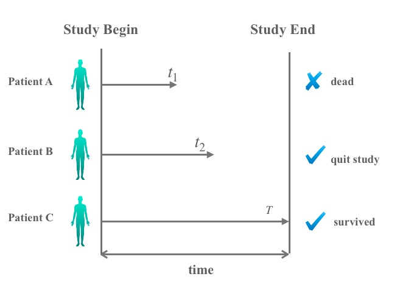
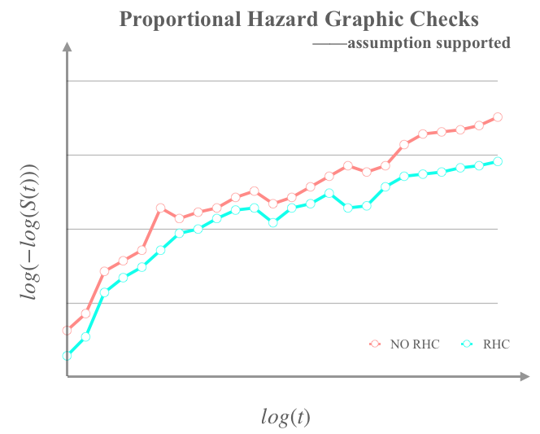

```{r setup, include=FALSE}
knitr::opts_chunk$set(echo = TRUE, message = FALSE,
                      warning = FALSE)
```


# Motivation

[Right heart catheterization (RHC)](https://www.hopkinsmedicine.org/healthlibrary/test_procedures/cardiovascular/right_heart_catheterization_135,40), also known as pulmonary artery 
catheterization, can be used to see how well or poorly a 
patient's heart is pumping or to measure the 
pressure in a patient's heart and lungs. Broadly, 
the procedure guides a pulmonary artery (PA) catheter 
(a small and hollow tube) through the pulmonary artery 
and into the right chambers of the heart. Here is a
video to help describe in more detail how it works.

<div align="center">
<iframe width="550" height="300" src="https://www.youtube.com/embed/xr-VkxUwceQ" frameborder="0" allow="accelerometer; autoplay; encrypted-media; gyroscope; picture-in-picture" allowfullscreen>
</iframe>
</div>

<center>
[source: https://www.youtube.com/embed/xr-VkxUwceQ]
</center>

However, it is often the case that when a foreign object 
enters the human body, there is the risk of infection. RHC
is no different. When the tube is put into the artery and 
a dye is injected into the heart, potential complications 
include the rupture of pulmonary artery or arrythmias of 
the heart where the heart may skip a beat. 

To evaluate the benefit of RHCs, one approach would be to use a 
randomized controlled trial (RCT). However, because of the 
widespread belief that RHCs are beneficial and safe, it 
is difficult to obtain approval and support to conduct an RCTs. Without an RCT of RHCs,
another approach to evaluate its effectiveness is to use an
observational study. 

The motivation of this case study is to investigate 
whether or not there is an impact on a patient's overall 
survival (or mortality) due to treatment with a RHC, using an observational dataset. 

Our main predictor of interest is RHC, but we also want 
to adjust for other potential confounders in the dataset 
as this is an observational study. Here, we want to know 
whether RHC actually improves the patient's overall survival 
within 30 days of being given a RHC, after adjusting for other
baseline variables, including age, race, blood pressure, etc.

In addition to loading the set of R packages from the
[`tidyverse`](https://www.tidyverse.org) that we will use 
for data manipulation, exploration and visualization, we also 
use the following R packages and describe their purpose 
for this this particular case study:

|R package|Purpose|
|---|--------------------------------------------------------------------------------------------------------------|
|`tableone`|Creates a table ('Table 1' below) to describe baseline characteristics of the sample|
|`kableExtra`|Helps with building complex tables and manipulating table styles; creates awesome HTML tables|
|`broom`|Takes the messy output of built-in functions in R such as `lm` or `t.test`, and turns it into tidy data frames|
|`ggpubr`|Provides some easy-to-use functions for creating and customizing `ggplot2`- based publication ready plots|
|`ggfortify`|Includes data visualization tools for statistical analysis results|
|`gridExtra`|Provides a number of user-level functions to work with "grid" graphics|
|`ggplot2`|Provides tools to create elegant data visualisations using the grammar of graphics|
|`survival`|Contains the core survival analysis routines, including definition of `Surv` objects, Kaplan-Meier and Cox models etc.|
|`survminer`|Contains functions for drawing Survival Curves using 'ggplot2'|
|`knitr`|Provides a general-purpose tool for dynamic report generation in R|
|`MatchIt`|Includes functions for nonparametric preprocessing for parametric causal inference|

In order to run this code please ensure you have these packages installed. 

```{r,warning = F}
library(tableone)
library(kableExtra)
library(tidyverse)
library(broom)
library(ggpubr)
library(ggfortify)
library(gridExtra)
library(ggplot2)
library(survival)
library(survminer)
library(knitr)
library(MatchIt)
```


The learning objectives for this case study include:

  * some basic data wrangling and visualizations (using the `tidyverse` packages)
  * a causal inference method: propensity score matching (using the `MatchIt` package)
  * multivariate logistic regression (using the `stats` package)
  * survival analysis (using the `survival` package)

# What is the data?

The data are available to download as a `.csv` file at this
[link](http://biostat.mc.vanderbilt.edu/wiki/pub/Main/DataSets/rhc.csv). 
The dataset includes a set of patients who were hospitialized
and either did or did not receive an RHC (also called a 
Swan-Ganz catheter) on day 1 of hospitalization. This
treatment variable is called `swang1` in the dataset. 
The description of all variables can be found in the
[codebook](http://biostat.mc.vanderbilt.edu/wiki/pub/Main/DataSets/rhc.html).


# Data Import

As the data are avaiable online, we will import them 
from the web directly with the `read_csv()` function from the 
[`readr` package](https://cran.r-project.org/web/packages/readr/readr.pdf) 
as part of the `tidyverse`. This dataset was 
originally used in in the paper [@Connors_1996],
and has been made publicly available.

```{r}
file <- "http://biostat.mc.vanderbilt.edu/wiki/pub/Main/DataSets/rhc.csv"
rhc <- read_csv(file)
```

Let's take a quick look at the first 
five rows and five columns of the dataset: 

```{r}
rhc[1:5, 1:5]
```

To get a sense of how many observations or columns 
we have, we can use the `dim()` function: 

```{r}
dim(rhc)
```

We will talk more about what the column names mean
in the next section. 

# Data Wrangling

## Variable selection

As we saw, there are in total `r ncol(rhc)` variables 
in the dataset. In this case study, we will select a 
subset of variables. If you are interested, you can 
change the list below to include other variables as 
a future exercise. 

```{r}
rhc_df <- 
  rhc %>% 
    select(age = age,
           sex = sex,
           race = race,
           education = edu,
           income = income,
           med_ins = ninsclas,
           disease = cat1,
           cancer = ca,
           weight = wtkilo1,
           temp = temp1,
           bp = meanbp1,
           resp = resp1,
           hrt = hrt1,
           pf = pafi1,
           ph = ph1,
           death = dth30,
           time = t3d30,
           RHC = swang1)
```

According to the 
[codebook](http://biostat.mc.vanderbilt.edu/wiki/pub/Main/DataSets/rhc.html), 
a summary of the variables we are interested
in is given below.

| variable names   |      meaning      |
|------------|---------------------------------|
| `age`                                  | Age                                                                                                                                                                 |
| `sex`                                  | Sex                                                                                                                                                                 |
| `race`                                 | Race                                                                                                                                                                |
| `education`                            | Years of education                                                                                                                                                  |
| `income`                               | Income                                                                                                                                                              |
| `med_ins`                              | Medical insurance                                                                                                                                                   |
| `disease`                              | Primary disease category                                                                                                                                            |
| `cancer`                               | Cancer                                                                                                                                                              |
| `weight`                               | Weight                                                                                                                                                              |
| `temp`                                 | Temperature                                                                                                                                                         |
| `bp`                                   | Mean blood pressure                                                                                                                                                 |
| `resp`                                 | Respiratory rate                                                                                                                                                    |
| `rth`                                  | Heart rate                                                                                                                                                          |
| `pf`                                   | PaO2/FIO2 ratio, ratio of arterial oxygen partial pressure to fractional inspired oxygen                                                                             |
| `ph`                                   | PH                                                                                                                                                                  |
| `time`                                 | Survival time of each patient in 30 days                                                                                                                            |
| `death`                                | Indicates whether the patient survived or dead in 30 days                                                                                                           |
| `RHC`                                  | Right heart catheterization |


# Exploratory data analysis

Our main interest is to investigate the influence of 
RHC on survival. but first let's use exploratory data 
analysis (EDA) to explore the relationship between RHC 
and the other variables in our dataset. 

First, we can stratify the samples in our data set into two groups according to the `RHC` column of the `rhc_df` 
dataset : the samples who either did or did not receive the 
RHC procedure. Then, we can summarize the potential
confounders within each group to determine if 
there are differences in these potential confounders between the two groups. These demographic summaries 
can help us understand the one to one relation between 
right heart catheterization and other variables.


We will use the function `CreateTableOne()` in the
[`tableone` package](https://www.rdocumentation.org/packages/tableone/versions/0.10.0)
to summarize both continuous and categorical variables 
with respect to the `RHC` column in our dataset. Then,
we can use statistical tests (specifically Chi-square 
and _t_-tests) to investigate the relationship between 
`RHC` and either continuous or categorical variables. 

```{r echo=T, results='hide'}
tblprint <- 
  CreateTableOne(data = rhc_df, strata = 'RHC') %>%
  print()

tblprint[c(3, 4, 9, 14, 21, 31, 42, 44),4] <- 'Chi-sq'
tblprint[c(2, 8, 35, 36, 37, 38, 39, 40, 41, 43),4] <- 't-test'
```

The `CreateTableOne()` function creates an object summarizing 
all baseline variables, optionally stratifying by one or more variables and performing statistical tests. The p-values from the statistical test comparing the two groups is given in the `p` column. To 
make this object easy to manipulate, e.g., to be able to change 
values or use the `kable()` function to display the table, we use the
function `print()` to change its type to a dataframe.

```{r}
kable(tblprint , "html", 
      caption = "Stritified by Right Heart Catheterization", booktabs = T) %>%
  kable_styling('responsive') %>%
  add_indent(c(5:7, 10:13,15:20,22:30,32:34))
```


The `kable()` function is a very simple table generator and enables you to 
create awesomes tables by playing with its arguments. Here, we use the `kable_styling()`
function to modify the style of HTML output, and use the `add_indent()` function
to add indentations to the row headers. All of this work is aimed to construct
a nice table.

What do you see? Take a moment to reflect on what these differences suggest. 
The unadjusted outcomes indicate that patients managed with RHC were more likely 
to be males, to have private insurance, to have under $11k income,
to also have an acute kidney injury 
([ARF](https://en.wikipedia.org/wiki/Acute_kidney_injury)), 
multisystem organ failure ([MOSF](https://en.wikipedia.org/wiki/Multiple_organ_dysfunction_syndrome))
or chronic heart failure ([CHF](https://en.wikipedia.org/wiki/Heart_failure)).
Patients with RHC were less likely to have cancer. 

Knowing information about how these characteristics differ between 
patients that were or were not managed with `RHC` is 
important because we want to identify the impact of `RHC` on survival, independent of other 
differences in the two populations of patients (e.g. whether they have cancer or not). We will 
learn in a little bit more about how to overcome these
differences between the two groups, and isolate the effect of RHC on mortality, below. 

## Data visualization

Next, let's use data visualization to explore the 
relationships between RHC and the other variables in 
our dataset. Here, we will use the `ggplot2` package 
from the `tidyverse`.

First, let's explore the `sex`, `race` and `med_ins` 
variables with respect to the `RHC` column. We will 
show different barplots using the `geom_bar()` function
in `ggplot2`. We also use the `ggarrange` function from the 
[`ggpubr` package](https://cran.r-project.org/web/packages/ggpubr/index.html) 
to arrange the subfigures into one plot. 

```{r, fig.width=11, fig.height=5}
p1 <- rhc_df %>% 
        ggplot(aes(x = RHC, fill = sex)) + 
          geom_bar() +
           ggtitle('Distribution of sex')
p2 <- rhc_df %>% 
        ggplot(aes(x = RHC, fill = race)) + 
          geom_bar(position = "fill") + 
           ggtitle('Distribution of race') + 
          ylab('Proportion')

p3 <- rhc_df %>% 
        ggplot(aes(x = RHC, fill = med_ins)) + 
          geom_bar(position = "fill") + 
           ggtitle('Distribution of insurance') + 
          ylab('Proportion')

ggarrange(p1, p2, p3, ncol=3, nrow=1)
```

The difference between the left plot and the 
other two plots, is the middle and right plots 
use the `position='fill'` option in
the `geom_bar()` function. In this case, it 
shows the proportion rather than count making 
the y-axis cover the entire range between 
0 and 1. 

These plots further match our understanding of the 
characteristics of patients: patients managed with 
RHC were more likely to be white males (teal and blue
in left two plots) and to have private insurance 
(blue in right plot). Here we just provide three examples, 
but we encourage you to try more variables that
you are interested in!

Besides these three categorical variables, we also 
pick three continuous variables and visualize them.

```{r, fig.width=11, fig.height=5}
p4 <- rhc_df %>% 
        ggplot(aes(x = RHC, y = age, fill = RHC)) + 
          geom_boxplot() + 
           ggtitle('Distribution of age')
p5 <- rhc_df %>% 
        ggplot(aes(x = RHC, y = bp, fill = RHC)) + 
          geom_boxplot() + 
           ggtitle('Distribution of blood pressure') +
            ylab('blood pressure')
p6 <- rhc_df %>% 
        ggplot(aes(x = RHC, y = pf, fill = RHC)) + 
          geom_boxplot() + 
            ggtitle('Distribution of PaO2/FiO2') +
              ylab('PaO2/FIO2 ratio')

         
ggarrange(p4, p5,p6, ncol=3, nrow=1)
```

The `age` difference between the RHC and No RHC 
groups seem to be negligible, while blood pressure 
(`bp`) and PaO2/FIO2 ratio (`pf`) have larger differences. 
We see that patients who receive RHC tend to have 
lower blood pressure (`bp`) than patients who do not. 
Similarly, patients who receive RHC tend to have 
lower PaO2/FIO2 ratio (`pf`), which indicates that 
blood pressure and PaO2/FIO2 ratio might be related to 
whether or not a patient receives the RHC treatment. 

# Data analysis

Because we want to investigate the impact of receiving 
the `RHC` treatment on a patient's 30-day survival,
we will use a branch of statistics called 
[survival analysis](https://en.wikipedia.org/wiki/Survival_analysis).
These methods can be used to analyze the expected duration of 
time until one or more events happen, such as death in 
biological organisms or failure in mechanical systems. 

## Survival analysis

### Right censoring

Before we talk about survival analysis, we need to talk about a 
type of time to event data in which the value of a measurement 
or observation is only partially known. This phenomenon is known as 
[censoring](https://en.wikipedia.org/wiki/Censoring_(statistics)). 
There are various kinds of censoring, but here we will focus 
only on left- and right-censoring. Right censoring is one of the 
most common types of censoring in survival analysis, see [@Klein_2006].

<center>

</center>

Suppose there are three patients, A, B and C who enroll in the study 
at time $t_0$, and the length of this study is $T$. Assume patient
A died at time $t_1$. In this case, we know his exact survival 
time and this patient is not censored. Next, assume 
patient B quit the study at time $t_2$, before the end of the 
study ($T$). And patient C was alive at the end of the study ($T$). 
In these cases, we treat patient B and patient C as _right censored_ 
because we know the patients were alive at time $t_2$ and $T$ respectively,
but do not know when death happened afterwards. Right 
censoring plays an important role here in determining survival time: the real survival time 
will always be equal to or greater than the observed survival time for right censored data.


### Kaplan-Meier 

In consideration of right censoring, the
[Kaplan-Meier estimator](https://www.ncbi.nlm.nih.gov/pmc/articles/PMC3059453/) 
can be a good choice to estimate the survival rate. 
It is a non-parametric method used to estimate the 
probability of survival. In general, the survival 
probability is calculated as 
one minus the probablity of death. At each time interval, 
the probability of death equals the number of patients
who died ($d_i$) divided by the number of patients 
at risk of dying ($n_i$). 
Here, the Kaplan-Meier estimator excludes the following people from the denominator: those who have 
died, those who withdrew from the study, those who are
lost to follow-up, or those who are alive without event occurrence 
at last follow-up (right-censored) - based on status at the time in question.
Otherwise it is likely that the probability of death will be underestimated. 

The estimated survival function is written as:

$$\widehat{S(t)}\ =\prod_{i:\ t_i\leq t}(1-\frac{d_i}{n_i}) $$

where $t_i$ is the time when at least one event 
happened. You can think of the method as a series of 
declining horizontal steps which, with a large enough 
sample size, approaches the true survival function for 
that population.

The `Surv()` function in the 
[`survival` package](https://www.rdocumentation.org/packages/survival/versions/2.11-4)
uses a specific class from the `survival` package 
to create a specialized object. It takes as input both 
the time to the event (`time`) and whether or not the
event has happened by the end of the study (`death`) 
and then creates an object that describes when right
censoring has occurred. 

Let's look at the `Surv()` function help file

```{r, eval=FALSE}
?Surv
```

We see we need variables for the `time` and `event` 
arguments to create a `Surv` object. In our data frame
we can use the `time` variable for the `time` argument. 
For the `event` argument, we can use the `death` 
variable, which is the response varable in our survival
analysis. 

**Note**: In the help file, for the `event` argument, 
it states that 

> "The status indicator, normally 0=alive, 
1=dead. Other choices are TRUE/FALSE (TRUE = death) or 
1/2 (2=death)."

Let's look at the data type of the `death` column in 
the `rhc_df` data frame. 

```{r}
str(rhc_df$death)
```

We see it is a vector of character strings. So to 
create a `Surv` object, we need to convert the datatype of
the column to a numeric. To do this we will use the 
`mutate()` function in the 
[`dplyr` package](https://www.rdocumentation.org/packages/dplyr/versions/0.7.8)
to transform the factor to a numeric variable. 
While we are here, we will also change the data 
type of `RHC` to be encoded as 0 for "No RHC" and 1 for 
"RHC" 

```{r}
rhc_df <- rhc_df %>% 
  mutate(death = if_else(death == "No", 0, 1), 
         RHC = if_else(RHC == "No RHC", 0, 1))
```

Let's check on what the datatypes are now. 

```{r}
str(rhc_df$death)
str(rhc_df$RHC)
```

Now we are ready to run the `Surv()` function. 

```{r}
sur_obj <- Surv(rhc_df$time, rhc_df$death) 
sur_obj[1:10]
```

Do you see `+` behind some of the survival times? This is an example of what 
we discussed before: right censored data points. `30+` indicates 
this patient survived until the end of the study while the `2`
means this patient died at the second day after study began. 

Also, the `sur_obj` object can be interpreted by the 
`survfit()` function from the `survival` package 
(see below) which is used to compute an estimate of a 
survival curve for censored data.
In addition to the `sur_obj` object that we created, the
`survfit()` function also requires as input the response 
variable of interest in a simple case of right-censored data. 
Here that is the `RHC` variable. 

```{r}
fit <- survfit(sur_obj ~ RHC, data = rhc_df)
fit
```

The reason why we get 'NA' here is: the median survival time is 
the time at which the survival rate equals 0.5. 
In our case, since minimum survival rate is over 0.6, 
it never gets as low as 0.5, and thus the output shows 'NA'.

The total number of the patients managed by RHC is 
`r sum(rhc_df$RHC == 1, na.rm = TRUE)`, and 
`r sum(rhc_df$RHC == 1, na.rm = TRUE)-fit$n.censor[58]` of them
died within 30 days (or a proportion of 
`r round(1-(fit$n.censor[58]/sum(rhc_df$RHC == 1, na.rm = TRUE)),2)`). 
The total number of the patients not having RHC is 
`r sum(rhc_df$RHC == 0, na.rm = TRUE)`, and 
`r sum(rhc_df$RHC == 0, na.rm = TRUE) - fit$n.censor[29]` of them 
died in 30 days (or a proportion of `r round(1-(fit$n.censor[29]/sum(rhc_df$RHC == 0, na.rm = TRUE)),2)`).

To show a visual display of the survival curve, the function
[`ggsurvplot()`](https://www.rdocumentation.org/packages/survminer/versions/0.4.4/topics/ggsurvplot)
from the package [`survminer`](https://cran.r-project.org/web/packages/survminer/index.html)
can be used to create a Kaplan-Meier curve for `survfit` objects. 
`ggurvplot()` returns an object of class `ggsurvplot` which is 
a list containing the survival plot, the data used to create the plot, etc.
We can also use this to show the survival rate stratified by 
whether or not a patient was managed with `RHC`.


**Note**: Here we are not adjusting for any other covariates, 
and we are only considering the `RHC` variable. In the sections below, 
we will discuss how to adjust for other covariates. 

```{r}
p_km <- ggsurvplot(fit, ylim = c(0.6, 1),
      legend.title = "RHC",
      legend.labs = c("0", "1"),
       ylab = 'survival probability', 
       xlab = 'survival time', 
       title = 'Kaplan-Meier Plot',
       ggtheme = theme_minimal())

p_km
```

The x-axis is the survival time, and the y-axis is 
the survival probability. The small vertical 
tick-marks indicate individual patients whose survival 
times have been right-censored. It looks like a
step function since the probability changes each 
day (the event data are recorded daily). When no 
truncation or censoring occurs, the Kaplan-Meier curve 
is the complement of the empirical distribution function.

Some further description of the plot: at the beginning, 
all the patients are alive. The survival probability at 
the end of 30 days of a patient having a right catheterization 
is `r round(p_km$data.survplot$surv[58],digits= 2)` 
compared to `r round(p_km$data.survplot$surv[29],digits= 2)` 
for patients not having the right catheterization. 

We see from the Kaplan-Meier plot that
patients with RHC treatment have a lower survival rate. 
But, think back to the 'Data visualization' section. 
We also saw a difference in the distribution for covariates 
such as blood pressure. This suggests that patients who are or are not 
managed by RHC might be different from one another due to other covariates as well. Therefore, the difference in observed 
survival rates might be driven by differences in 
the other covariates. Our goal is to determine whether RHC 
has an impact on survival, but we want to make a fair 
comparison between the patients managed with and without RHC. 
Therefore, we are curious if there is still a difference in 
survival after adjusting for potential confounders. We will introduce propensity scores and 
propensity score matching in the next few sections as a way to do this adjustment. 


## Propensity score matching

As we mentioned above, it is a popular belief that
it is beneficial for patients to be managed by RHC [see @Connors_1996]. 
Therefore, a RCT is not possible. However, one of the main benefits of an RCT is that randomization helps us to isolate the effect we are interested in measuring, by making sure the two comparison groups are otherwise similar on all other relevant variables. In an observational data set, this is rarely the case, especially when variables are used to assign treatment that may also have an impact on patient survival. The Connors et al. paper
explains this phenomenon like this: 

> In observational studies, the treatment selection has a connection 
with patient characteristics but also has a link with the outcomes. 
For example, patients with lower blood pressure are more likely to get RHC, 
and they are also more likely to die. The effect of such treatment selection bias 
has been called "confounding by indication". 

This means that if we were to directly compare the mortality of patients who did or did not receive RHC, we would not only be observing the effect of RHC, but also the effect of blood pressure on mortality, since a higher proportion of the people who received RHC will also have high blood pressure. We need a way to ensure that we are isolating the effect of RHC in our analysis, by somehow making our groups comparable to one another when measuring the effect of interest. In the next section, we will introduce propensity scores 
as a way to adjust for treatment selection bias. 

### Propensity score: conceptual framework

The propensity score is defined as the probability a patient receives a treatment, 
taking into account the complete information about this patient. 
The information may include variables that affect the chance that the patient receives the treatment, such as `age`, `gender`, `blood pressure` etc. To use propensity scores, we need a way to estimate this probability for each patient, and then figure out how to use these propensity scores to isolate the effect we are interested in measuring, i.e., the effect of RHC on patient survival. 


It turns out that we can estimate the propensity score using a tool we may have used in other contexts: logistic regression. To set up the logistic regression model, the potentially informative variables are treated as 
explanatory variables in the model, while the 
response variable is a binary variable indicating whether or not 
this patient received treatment. In our case, this is the `RHC` variable. The sections below will go into more detail about the reasoning behind using propensity scores, how we calculate them, and how we use them in our survival analysis.


### Propensity score matching: conceptual framework

To adjust for treatment selection bias, the variables that
independently affect the decision to use or withhold the treatment 
must be identified, measured and somehow adjusted for. Here we will accomplish this adjustment
with what's called 
[propensity score matching (PSM)](https://en.wikipedia.org/wiki/Propensity_score_matching). 

In a statistical analysis with observational data, PSM is 
a technique that attempts to estimate the effect of a
treatment, policy, or other intervention by modeling covariates
that predict receiving the treatment, and then matching patients who had similar probabilities of receiving treatment, but who had different treatment assignments. These pairs of patients are similar to each other in terms of their prior chance of receiving treatment, so when we compare their outcomes, we are controlling for those things that influenced the treatment decision. PSM attempts 
to reduce the bias due to the confounding variables by ensuring
that outcomes among units that received the treatment are 
compared fairly to outcomes that did not receive the treatment. 
When we say "fairly", we mean that the outcomes have similar 
probabilities of receiving the treatment. 

In general, the procedures of PSM include:

* Run logistic regression:
    + Dependent variable: Y = 1, if with RHC; Y = 0, otherwise.
    + Choose appropriate confounders and apply multivariate logistic regression.
    + Obtain propensity score, which is the predicted probability (p) of receiving treatment. A higher score indicates a higher probability of receiving the treatment.

* One-to-one matching on propensity score:
    + Randomly select one patient with RHC.
    + Match this patient who has the closest propensity score in all patients without RHC. The difference should be less than a certain threshold (to be discussed later)
    + Continue this matching until all possible pairs are identified.
    
Let's use a plot to explain how the matching works. 

<center>

</center>

Each dot represents a patient in the observational study, grouped and colored according to whether they received (bottom line, teal) or did not receive (top line, pink) RHC. The position of the point on the line reflects the propensity score from 0 (on the left) to 1 (on the right). 
A larger propensity score reflects a higher probability 
of receiving the treatment and vice versa for a lower score.
In the cartoon, there are 5 patients who receive the RHC treatment (teal) 
and 5 patients without RHC treatment (pink). Using the covariates in a 
logistic regression model, we estimate the propensity score. Then,
we match patients based on propensity score across the two groups. 
The closer their propensity score is,the more likely they will be 
matched as a pair. 

Here, there are 3 pairs in the middle: A1 and B1, A2 and B2, A3 
and B3, as these are the closest matching pairs. However, there are 
2 samples on the left in the No RHC group 
and 2 samples on the right in the RHC group (separated by dashed line) that do not matches. 
This is because there are no samples whose propensity scores are close to theirs. 
In this case, they fail to be matched and will be removed from downstream
analyses. After the matching is complete, we have 3 pairs of patients that 
are matched successfully (or 3 samples with RHC treatment and 3 samples 
without RHC treatment).

### Estimating propensity scores: the details

As we mentioned above, the propensity score is calculated using logistic regression
in which the treatment assignment is the dependent variable. Logistic regression measures the relationship between a set of predictor variables and a binary (0 or 1) outcome. Based on the estimated logistic regression model, we can predict the probability that any indvidual, with a certain set of values of the predictor variables, has an outcome value of 1. The
`glm()` function in the 
[`stats` package](https://stat.ethz.ch/R-manual/R-devel/library/stats/html/00Index.html) 
is widely used to estimate generalized linear models, of which logistic regression is a special case. 
The argument `family =` provides a convenient way to specify the 
details of the models used. Here, since the outcome
is binary and we would like to fit a logistic regression model, 
we set `family = binomial(link = "logit")`.

We exclude `time` and `death` here because these two variables have no 
relationship with treatment assignment (`RHC`) and only relate 
to the survival analysis that we will perform later on. Since these two variables were measured after treatment, they were not involved in the determination of whether a patient received RHC.

```{r}
psm_glm <- glm(RHC ~ . - time - death, 
               family = binomial(link = "logit"), 
               data = rhc_df)
```

Using this model, we can calculate the propensity score
for each patient. It is simply the patient's predicted probability 
of receiving a RHC, given the estimated coefficients from the 
logit model. To do this, we will use the `predict()` function
and create a data frame that has the propensity score 
as well as the patient's actual treatment status.

```{r}
p_rhc = predict(psm_glm, type = "response")
glm_df <- data.frame(p_rhc = p_rhc,
                     p_norhc =  1 - p_rhc,
                     RHC =  psm_glm$model$RHC)
```

Inside the data frame, the `p_rhc` is the predicted probability of 
being assigned to RHC, while `p_norhc` is the predicted probability of 
being assigned to no RHC.

After estimating the propensity score, we can plot the propensity
scores by treatment status using histograms. 

```{r}
glm_df %>%
  mutate(RHC = ifelse(RHC == 1, "RHC", "No RHC")) %>%
  ggplot(aes(x = p_rhc,fill = RHC, color = RHC)) +
  geom_histogram(alpha=0.5, position = 'identity')+
  xlab("Probability of receiving RHC before matching") +
  ylab("density") + theme_bw()
```

Note that you can change the `position` adjustment to use for 
overlapping points on the layer (default value is `position ='stack'`).
In contrast, the `position = 'identity'` argument will place each 
object exactly where it falls in the context of the graph. 
Finally, since we have overlapping bars we can make the bars slightly 
transparent by setting `alpha` to a small value. 

We can clearly see the distribution of propensity scores is not 
balanced across the two groups. This is not surprising since we know that the decision to give a patient a RHC was made based on some of the variables included in our model; the patients who received a RHC were more likely to receive one than  the patients who did not. In order to make our RHC and non-RHC groups more comparable to one another, we will move to the 
next step: one-to-one matching.


### One-to-one matching on propensity score

Based on the example above, you might think that it would be a lot of work to find the best set of matching samples from the treatment and control groups in our data set. However, other people have written some useful code to make this process much easier.

The `matchit()` function is the main command of the package 
[`MatchIt`](https://cran.r-project.org/web/packages/MatchIt/MatchIt.pdf), 
which uses parametric models for causal inference to select well-matched
subsets of the original treated and control groups.

The arguments of the `matchit()` function are given below:

* `formula`: Specifies the logistic regression formula you would like to use. 
Here, we just use the same logistic regression model, `psm_glm`, that we created in last section.

* `data`: Data frame (or database table name) containing the variables for analysis in the formula arguments.

* `method =`: Specifies the matching methods. Options include:
    + `exact`: Matches each treated unit with a control unit that 
    has exactly the same values on each covariate. It is useless when there are too many variables.
    + `subclass`: Breaks the data set into subclasses so the distributions of 
    the covariates are similar in each subclass.
    + `nearest`: Matches a pair that is closest in terms of a distance measure (This is the default method).
    + `optimal`: Minimize the average absolute distance across all matched pairs.
 
* `caliper`: For the nearest neighbor matching, this has a further restriction that 
the absolute difference in the propensity scores of matched subjects must be below 
some prespecified threshold (the `caliper` distance). [see @Austin_2011] suggested 
using a caliper size of one-fifth of a standard deviation of the sample estimated 
propensity scores.

* `ratio`: Indicates the ratio of treatment cases to control cases to match. 
Default is one-to-one matching. You can increase the number of control cases matched to
each treatment case by increasing this number; usually this number is between 1 and 5.

If we dig into [see @Austin_2011], we will find that to 
specify the value of `caliper` (or the threshold), the 
standard deviation of the log odds of the estimated propensity 
scores is necessary. We calculated these propensity scores in the previous 
section. We see that the `p_rhc` will be useful now!

First let's calculate our threshold that we will use in `caliper`. 

```{r}
epsilon <- 0.2*sd(log(p_rhc/(1-p_rhc)))
```

Then, we can run the `matchit()` function!

```{r}
set.seed(1234)
psm_mod <- matchit(RHC ~ age + sex + race + education +
                     income + med_ins + disease + cancer +
                     weight + temp + bp + resp + hrt + pf +
                     ph, data = rhc_df, method = "nearest", 
                   caliper  = epsilon, ratio = 1)

rhc_psm_df <- match.data(psm_mod)
colnames(rhc_psm_df)
```

Using the `match.data()` function, we can get the final 
dataset with matched patients (`rhc_psm_df`). Note that 
the final dataset is smaller than the original: it contains 
`r dim(rhc_psm_df)[1]` observations, meaning that 
`r 0.5*dim(rhc_psm_df)[1]` pairs of treated and control 
observations were matched. It also contains a variable 
called `distance`, which is the propensity score.  

Let's check out what the distribution of propensity scores 
looks like in our matched dataset: 

```{r}
rhc_psm_df %>%
  mutate(RHC = ifelse(RHC == 1, "RHC", "No RHC")) %>%
  ggplot(aes(x = distance,fill = RHC, color = RHC)) +
  geom_histogram(alpha = 0.5, position = 'identity') +
  xlab("Probability of receiving RHC after matching") +
  ylab('density') + theme_bw()

```

Now the distributions of propensity scores in the two groups are much
more balanced! In addition to using `ggplot2`, there 
is another way to present this result using the 
[`plot()` function](https://www.rdocumentation.org/packages/MatchIt/versions/1.0-2/topics/plot.matchit)
inside the `MatchIt` package.

```{r}
plot(psm_mod,type = "hist" )
```

Just putting the `psm_mod` object in `plot()` 
produces a nice plot, showing the distributions
of propensity scores before and after matching. The 
histograms before matching are on the left,
and the histograms after matching are on the right. 


## Cox Proportional Hazard Model

Given our new balanced data set, let's continue to investigate the 
effect of RHC on the probability of survival 
for the patients who were or were not treated 
with RHC. 

In our Kaplan-Meier plot, we created the `sur_obj` object 
with the time that passes (`time`), and the event that 
occurs (`death`) in order to plot the survival curve. This 
non-parametric method is a simple comparision which 
can be used to get a first-pass understanding based on 
a single covariate (e.g. `RHC`). More often than not,
we want to estimate survival probablities taking 
into account additional characteristics that may
influence the outcome, such as `blood pressure`, or  
`age`. In our case, we are interested in the effect 
of `RHC`, but we also know there are additional 
covariates that also might effect the outcome. So, we 
would like to adjust for these additional covariates. 

This is where we will introduce the
[Cox proportional hazards model](https://en.wikipedia.org/wiki/Proportional_hazards_model)
(Cox PH model), 
which is essentially a regression model used to investigate
the association between the survival time of patients 
and one or more predictor variables. While the 
Kaplan-Meier curve is an example of a _univariate_ 
analysis (only describing the survival with respect to 
one covariate), the Cox PH model can be a _multivariate_
model that simultaneously assesses the effect of 
multiple covariates on survival time. 


### Basics of the Cox PH model

The Cox PH model is expressed using the hazard function
$h(t)$ at time $t$. The intepretation of the hazard 
function is the risk of dying at time $t$. 

To get a sense of what the hazard function is, let's first consider the 
survival function. If $T$ is a continous random variable representing the time of death, 
with probability distribution $f(t)$ and cumulative 
distribution $F(t)$ that represents the survival time, 
we can describe the cumulative distribution function as

$$F(t) = Pr(T < t)$$

The complement of the cumulative distribution is 
survival function $S(t)$

$$S(t) \equiv Pr(T \geq t) = \int_{t}^{\infty} f(t) dt$$

where $f(t)$ is the probability density function
at time $t$. 

Now, as mentioned above, the hazard function is 
risk of dying at time $t$. Another way of phrasing 
this is given the patient was alive
at time $t$, what's the conditional probability of 
dying in the next time interval of length  $\Delta t$, 
or that the event, death, will occurr in the interval 
$[t,  t+ \Delta t)$.

$$ h(t) =\displaystyle{\lim_{\Delta t \to 0}} 
\frac{ P(t \leq T <t+\Delta t|T \ge t)}{\Delta t} 
= \frac{ P(t \leq T <t+\Delta t)}{P(T \ge t) \Delta t} 
= \frac{ f(t) \Delta t}{S(t) \Delta t} $$

which can be written as the joint probability of the event 
occuring in the interval $[t,  t+ \Delta t)$ and $T \ge t$ 
(which is the same as the event occuring in the interval 
$[t,  t+ \Delta t)$), divided by the probability of $T \ge t$. 
The numerator is just $f(t) \Delta t$ for small $\Delta t$ and 
denominator is just $S(t)$. 

If we divide by $\Delta t$ and take the limit as 
$\Delta t \to 0$, then the hazard function is just 

$$h(t) = \frac{f(t)}{S(t)}$$

Neat! OK now we are ready to get back to the Cox PH
model. As a reminder, we noted that the Cox PH model 
is expressed using the hazard function $h(t)$ 
at time $t$. For the $i^{th}$ observation and a given
set of covariates 
$\mathbf{X}_i = \{ X_{i1}, \ldots X_{ip} \}$, 
the Cox PH model has the form 

$$h(t | \mathbf{X}_i)= h_0(t)  \exp(\beta_1 X_{i1} + \ldots \beta_p X_{ip}) 
= h_0(t) \exp(\beta \mathbf{X}_{i}) $$

where the coefficients $\beta = \{\beta_1, \ldots, \beta_p \}$
are the effect sizes of the covariates $\mathbf{X}_i$. 
The quantities $\exp({\beta_j})$ are called hazard ratios (HR). 
If $\beta_j > 0$ (or $\exp({\beta_j})$ > 1), this implies as 
$X_{ij}$ increases, the hazard increases and thus the 
survival probability decreases. In constrast, if the HR is 
less than 1, then this is a reduction in the hazard (or 
an increase in survival). 

**Note**: If you take the log of the hazard function, this
becomes a linear model with a baseline hazard function 
that varies over time. However, another link function is the 
"complementary log-log" model (or $log(-log(1-h(t)))$), 
which is useful when the probability of an event is very 
small or very large. 

Finally, $h_0(t)$ is the baseline hazard at time $t$. 
This is the hazard if all the $\mathbf{x}_i$ are 0. A 
**key assumption** of the Cox PH model is 
that the baseline hazard curves for groups of observations 
should be proportional and cannot cross.

Let's explore what we mean by this. Consider the $i^{th}$ and
$j^{th}$ observation and suppose we have only one covariate $X_1$, with 
observed values that differ between the $i^{th}$ and
$j^{th}$ observations. The ratio of their hazard functions is

$$ \frac{h_i(t|X_{1}  = x)}{h_j(t|X_{1} = x^{'})}=\frac{h_0(t) e^{\beta x}}{h_0(t) e^{\beta x^{'}}}=e^{\beta (x-x^{'})}$$


which is independent of time. Another way of 
phrasing this is that the hazard of the event in any group
is a constant multiple of the hazard in any other group. 

This assumption should always be checked when using the
Cox PH model (we give an example of this below). 


### Model Application

Now, we can fit a Cox PH model using the `coxph()` function, 
from the `survival` package. Similiar to when we estimated a 
Kaplan-Meier curve, we first create a survival object 
using the `Surv()` function (e.g. `Surv(time, death)`). 

In the next section, we will first fit a few univariate Cox 
PH models to illustrate the model behavior and interpretation. We will then fit a multivariate Cox PH 
model using all the covariates in our dataset (`rhc_psm_df`). We note that both of these models are using
the data after matching based on propensity scores.

SHEENA: Can you add a comment about why it is important to adjust for covariates again, even when you have matched based on the propensity scores?

#### Univariate Cox PH model

To fit a univariate Cox PH model, we include
only one variable in the Cox PH model formula. Here we select 
the `RHC`, `age` and `weight` variables as examples, 
and show the results.

A univariate Cox PH model for `RHC` is given by 

```{r}
fit_uni1 <- coxph(Surv(time, death) ~ RHC, 
              data = rhc_psm_df)
```

We can also use the `tidy()` function in the 
[`broom`](https://cran.r-project.org/web/packages/broom/index.html)
package to create a `tidy` representation of the 
model output. We just show the head of it here, but 
you are encouraged to research more if you are 
interested in it!

```{r}
res <- tidy(fit_uni1, conf.int = TRUE,
                conf.level = 0.95)
res
```

Next, a univariate Cox PH model for `age` is given by 

```{r}
fit_uni2 <- coxph(Surv(time, death) ~ age, 
              data = rhc_psm_df)

res <- tidy(fit_uni2, conf.int = TRUE,
                conf.level = 0.95)
res
```

Finally, a univariate Cox PH model for `weight` is given by 

```{r}
fit_uni3 <- coxph(Surv(time, death) ~ weight, 
              data = rhc_psm_df)

res <- tidy(fit_uni3, conf.int = TRUE, 
                conf.level = 0.95)
res
```

Looking at the results, we see that `RHC` and `age` 
are associated with survival, while `weight`
does not have a statistically significant effect. 

#### Multivariate Cox PH model

Next, we will fit a Cox PH model using the `coxph()` 
function and including all the covariates in our dataset 
(`rhc_psm_df`), after propensity score estimation. 

First, we recall the column names in our dataset: 

```{r}
colnames(rhc_psm_df)
```

To incorproate all the variables in the model, we can 
use the `~ .` R model formula syntax, but we need to 
use the negative sign (`-`) to exclude some variables. 
We see the propensity score (`distance`) and weights 
(`weights`) that were calcuated by `matchit()` are 
included in our data frame, but are not needed in model fitting. We 
also do not want to include the covariates `time` 
or `death` as these covariates are used in the `sur_obj`
object to note right censored observations. 

```{r}
fit_all <- coxph(Surv(time, death) ~ . - time - death -
              distance - weights, 
              data = rhc_psm_df)

res <- tidy(fit_all, conf.int = TRUE,
                conf.level = 0.95)
head(res)
```

Recall, the coefficients here (`estimates`) are the 
$\beta_j$ coefficients. We can convert this to hazard ratios 
by exponentiating the coefficients. If the exponentiated 
coefficient is larger than 1, the variable will increase 
the hazard of the event occuring (or decrease the 
survival probability). 

Note, we can also ask to report the coefficients 
(`estimate`) and confidence intervals on an 
exponential scale with the `exponentiate = TRUE`
argument. 

```{r}
res_exp <- tidy(fit_all, exponentiate = TRUE, 
            conf.int = TRUE, conf.level = 0.95)
head(res_exp)
tail(res_exp)
```


### Check the fundamental assumption

Now that we have fit our Cox PH model, let's check 
the assumptions of the Cox PH model in our data. 
If you recall, the **fundamental assumption** of the 
Cox PH model is that the model assumes the hazard is
constant with time. For instance, in our case we 
want to evaluate the relationship between patients being 
managed with the RHC treatment and the hazard of death, 
controlling for possible confounding variables which might
be related to death. But what if some variables' values 
change over time?

#### Complementary log-log plot

One way to check the fundamental assumption is to use a data visualization. A plot that shows a non-random pattern 
against time is a violation of the assumption. 

The first plot we will consider is the "complementary 
log-log" model, which displays ($log(-log(1-h(t)))$ or $log(-log(S(t)))$ 
vs. $ln(t)$. For a given variable (e.g. `RHC`), here is
a cartoon of what it looks like if the assumption is 
not violated:
  
<center>

</center>

And here is a cartoon of what it might look like if the 
assumption was violated: 

<center>

</center>

Here we see that the survival curves cross, clearly 
indicating a violation of the proportional hazards assumption, i.e., the ratio of the baseline hazard values is not constant over time, but is smaller or bigger as the lines get closer together or farther apart. 

Now let's look at this visualization using our data. We still use
`ggsurvplot()` to plot it. The `fun` option is an
arbitrary function defining a transformation of 
the survival curve, and we use `log(-log(x))` to 
get the complementary log-log plot: 

```{r}
sur_obj2 <- Surv(rhc_psm_df$time, rhc_psm_df$death)

ggsurvplot(survfit(sur_obj2 ~ RHC, data = rhc_psm_df),
           fun = function(x){log(-log(x))})
```

Our dataset doesn't violate the assumption.


#### Statistical assessments 

Another approach is to use a formal statistical test to 
asesses the proportional hazards assumption. Here we will 
use the `cox.zph()` function in `survival` package. It tests
for proportionality of all the variables specified in the model 
by creating interaction terms with time (on the log scale). 
Then, the function will test for independence of each 
variable. It also performs a global test for all the 
interactions tested together in the model. If the _p_-value 
is less than 0.05, this suggests a violation of the PH
assumption. [see @Grambsch_1994]

For instance, if our model is 
$log~h(t|X_1)= \beta_0 + \beta_1 X_1$ (where 
$\beta_0 = \log(h_0(t))$), to test whether $X_1$ is 
time-varying, the `cox.zph()` function creates an 
interaction term $X_1*log~t$ in the model. 
Now the model is 

$$log~h(t|X_1)= \beta_0 + \beta_1~X_1 + \beta_1^{'}(X_1*log~t)$$

Using a null hypothesis of $H_0: \beta_1^{'}=0$, we can 
assess whether or not there is a relationship with time according to whether we reject or fail to reject the null hypothesis. Note, 
a _p_-value less than a specified Type 1 error (e.g. $\alpha$ 
= 0.05) suggests there is evidence that the effect of the variable ($X_1$) is 
time-varying.

To illustrate the test, we use our data set as an example,
and we use the `fit_all` Cox PH model from above. The `transform`
argument describes how the survival times should be
transformed before the test is performed. For example, we 
use `transform = log` to get $X*log~t$ in our model. 

```{r}
check.ph <- cox.zph(fit_all, transform = 'log')
check.ph 
```

The first column (`rho`) gives the Pearson product-moment 
correlation between the scaled [Schoenfeld residuals](https://www.mbaskool.com/business-concepts/statistics/8766-schoenfeld-residuals-test.html) 
and `log(time)` for each covariate, which is the difference 
between the covariate for that subject and the weighted average 
of covariates in the risk set. The last row contains
the global test for all the interactions tested at once. 

We notice the _p_-value for `ph` is less than 0.05, 
suggesting that there may be a violation of the Cox PH
assumptions for this variable. If you recall, this variable
represents the PH level from the patient. 

Let's explore this a bit more with a graphical assessment of 
the Schoenfeld residuals. Here we pick out 6 variables (`age`, 
`sex`,  `education`, `diseaseComa` and `diseaseCOPD`, as well as `ph`) and graphically assessess 
whether or not there is a relationship between the variable and time. 
We will use the function `ggcoxzph` in package `survminer`, 
which will generate plots of residuals for individual 
predictors against time, where a non-zero slope is evidence against
the Cox PH assumption. 

```{r,fig.width=9, fig.height=8}
#get graphical diagnostic for `age`, `sex`, `education`, `diseaseComa`, `diseaseCOPD` and `ph`
plist <- ggcoxzph(check.ph, point.alpha = 0.1)[c(1,2,5,17,18,30)]
#plot them in one chunk
grid.arrange(grobs = lapply(plist, ggplotGrob), ncol =2)
```

The `grid.arrange()` function in the package `gridExtra` can be  
used to arrange several plots in one chunk. The `ggcoxzph` 
function returns an object which is a list of ggplot objects, 
rather than plot a `grob`, or more specifically, gtables. 
`gtables` are matrix-like layouts placed in cells that can
be directly used as an input in `grid` system and related packages.
So to convert them, we use `ggplotGrob()` function in package 
`ggplot2` to generate ggplot2 plot grobs that are compatible
with function `grid.arrange()`.

In the figures above, the solid line is a smoothing spline
fit to the plot, with the dashed lines representing a 95% confidence
interval. As we said, an apparent departure from a horizontal 
line indicates violation for assumption. All of these 6 
variables have a zero slope, suggesting the assumption is 
not violated. For more information on graphical diagnostics, 
we refer the reader to [@Klein_2006]:

> "We prefer graphical checks to formal goodness-of-fit test because 
we believe that the proportional hazards assumption only approximates
the correct model for a covariate and any formal test, based on
a large enough sample, will reject the null hypothesis of proportionality."

Therefore, even though we see a _p_-value less than 0.05 for 
the `ph` variable, we do not see a strong relationship with time. 
One way this can happen is if we are testing a model with many 
variables, the _p_-values from some variables may be less 
than 0.05 by chance. Especially when there are lots of 
variables, a subtle deviation will be reflected in the p-value. 


### Comparing estimates of survival 

Now let's assess whether or not `RHC` has an effect on 
the overall survival, given that we have now adjusted 
for potential confounders using a Cox PH model 
and selected a balanced population of patients using 
propensity score matching. 

If you recall, the univariate Cox PH model that we fit
showed a strong effect of `RHC` on survival: 

```{r}
fit_uni1 <- coxph(Surv(time, death) ~ RHC, 
              data = rhc_psm_df)

res_uni1 <- tidy(fit_uni1, exponentiate = TRUE,
            conf.int = TRUE, conf.level = 0.95)
res_uni1
```

For the multivariate case, the result is shown below.
We are only interested in the `RHC` variable so we extract its
result:

```{r}
fit_all <- coxph(Surv(time, death) ~ . - 
                   time - death -
                   distance - weights, 
                 data = rhc_psm_df)

res_all <- tidy(fit_all,exponentiate = TRUE,
            conf.int = TRUE, conf.level = 0.95)

res_all[res_all$term == 'RHC', ] # row contains result for RHC
```

Then we would like to summarise them in a table:
```{r}
df_res <- 
  data.frame(c1 = c("RHC", "RHC"),
        c2 = c("univariate Cox PH", "multivariate Cox PH"),
        c3 = c(res_uni1$estimate, res_all[31,]$estimate),
        c4 = c(res_uni1$p.value, res_all[31,]$p.value),
        c5 = c("None","Variables in `rhc_psm_df`")) 
colnames(df_res) <- c("Prognostic variable","Method ", "HR",
                      "p-value", "Adjusted for")

df_res %>%
  kable(caption = "Prognostic result for RHC") %>%
  kable_styling()
```

The results for these two models are not very different from one another.

Also, we can add survival plots with the curves split 
by `RHC` with the help of the `ggadjustedcurves()` function in 
`survminer` package. 

If we compare this to the survival plot after adjusting for 
other covariates, we see that: 

```{r,fig.width=12, fig.height=6}
# Univariate case
p_uni1 <- ggadjustedcurves(fit_uni1, data = rhc_psm_df,
      variable = "RHC",
      ylim = c(0.6, 1), legend = "top",
      legend.title = "RHC",
       ylab = 'survival probability', 
       xlab = 'survival time', 
       title = 'Cox PH (univariate)',
       ggtheme = theme_minimal())

# Multivariate case
p_all <- ggadjustedcurves(fit_all, data = rhc_psm_df,
      variable = "RHC",
      ylim = c(0.6, 1), legend = "top",
      legend.title = "RHC",
      ylab = 'survival probability', 
      xlab = 'survival time', 
      title = 'Cox PH (multivariate)',
      ggtheme = theme_minimal())

grid.arrange( p_km$plot, p_uni1, p_all, ncol = 3)
```

You might ask why did we put `p_km$plot` in 
`grid.arrange()` function? Similiar to the question 
before, `p_km` is a list created by function
`ggsurvplot()` and it is not compatible with 
`grid.arrange()`. However, a function called 
`arrange_ggsurvplots()` can be used to arrange
multiple `ggsurvplot`s. 

However, the other two plots are created by 
`ggadjustedcurves()`, which are compatible with 
`grid.arrange()`. There is an easy way to solve this issue: 
extract the `plot` object from list `p_km`.

The middle and right plots show survival curves
for a matched dataset, corresponding to univariate 
or multivariate model respectively. In the multivariate 
case, the difference in the survival rate seems to be smaller 
than in the univariate case, but it is only a slight difference.

Compared with the Kaplan-Meier plot (left), whether 
we use a univariate or multivariate model, the 
difference of the survival rate between these two 
groups is attenuated. However, patients in the `RHC` group still
have a lower survival rate than those in the `No RHC` group. 


# Summary

In this case study, we explored the association between time to death 
and RHC based on an observational dataset collected over the course of 30 days. We covered various statistical topics 
to help us assess this association, such as survival analysis, propensity score matching and
the Cox proportional hazards model. Based on our analyses, we can conclude that RHC has a positive relationship with 
the risk of mortality even when adjusting for confounding variables. 

We started by looking at the data, separating the dataset into two groups based on whether or not the subject received RHC, 
using the variable `RHC`. We made a table to show the distributions of all other variables
in the two groups, and made some figures to visualize these differences. We found some variables have large differences, 
such as blood pressure and PaO2/FIO2 ratio, while others do not vary too much, like age.


Next we tried the Kaplan-Meier method, a non-parametric method, to find 
the relationship between survival rate and whether a patient received RHC treatment or not. 
The result was shown as a survival curve plot. It provided us an initial understanding 
that the survival rate is higher in the population managed without RHC treatment. 

But, since we are working with an observational dataset, the bias in treatment selection 
is an unavoidable problem, so these initial results may be misleading. To solve this problem, we made use of 
the causal inference method of propensity score matching. Logistic regression was 
applied to determine the probability of receiving RHC (propensity score), given an array of additional variables. 
This probability represented the relationship between multiple covariates and the use of RHC 
and was used as a criterion to match subjects. We matched subjects based on propensity score 
and finally kept `r 0.5*dim(rhc_psm_df)[1]` pairs. As expected, the remaining data showed a much more balanced distribution of propensity scores across the two groups.

In the next step, we further improved our survival analysis model
by using a parametric method, the Cox proportional hazards model. First
we applied a univariate model, showing three examples. Then all necessary
variables were included, to avoid ignoring potential confounders. 
We also evaluated the proportionality assumption that is made when using a Cox PH model, both with graphical
checks and a statistical test. There is no obvious pattern with time
so the assumption does not seem to be violated in our data set. 

Finally, we fit a mutlivariate Cox PH model to assess adjusted outcomes. Comparing the univariate and 
multivariate model, the difference of survival between two groups decreases with the multivariate model, 
supporting our choice of performing data matching to alleviate confounding. However, 
the survival rate for patients with RHC treatment is still lower than
patients without RHC treatment so we concluded this treatment is harmful.


Opportunities for further improvement of our model include variable selection 
and model engineering. The original data set includes `r nrow(rhc)` variables but we used just 
`r nrow(rhc_psm_df)` variables in our analysis. Including additional informative variables could provide more information,
and give us a more accurate result. You are encouraged to construct a more complex model with 
further variables and model engineering.

Our outcomes seem to directly oppoese the widespread belief that RHC is 
recommended in broad clinical applications. This may be caused by the fact that confounding variables 
which increase the probability of receiving RHC and the probability of death overall make it difficult to accurately assess the impact of RHC based on anectodal observation. Our analysis, which attempts to control for these confounders, aims to produce a more rigorous statistical result, within the limitations of this observational data set. 
However, we admit the limitations of this study and are happy to receive additional suggestions to 
better understand the role of RHC. 


# Reference


